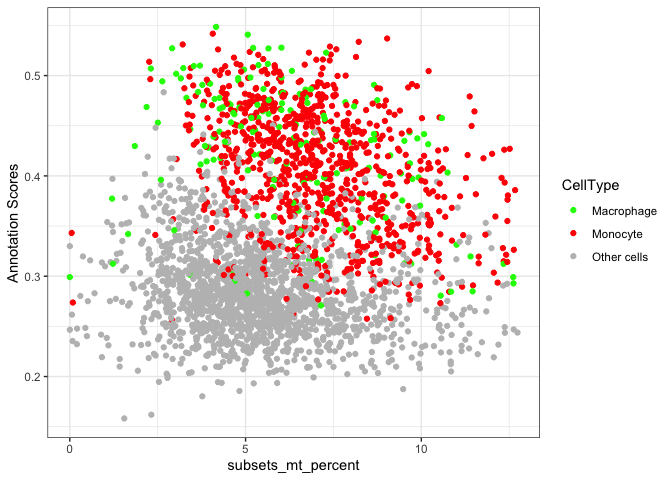
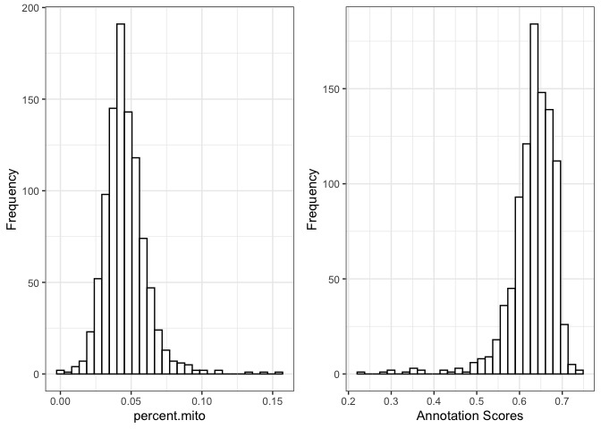
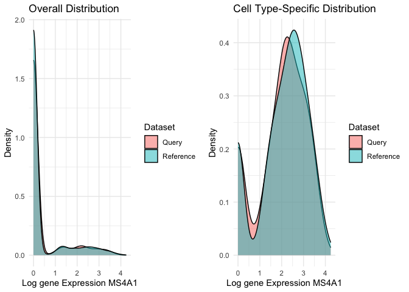
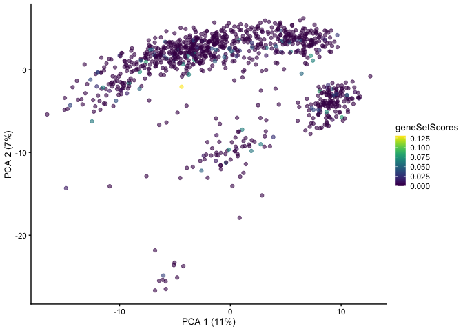
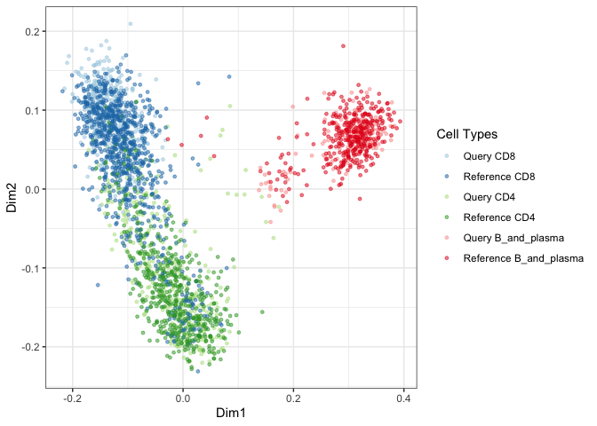
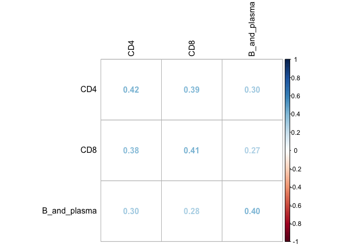
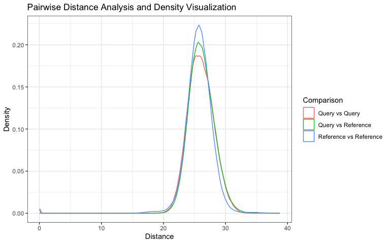
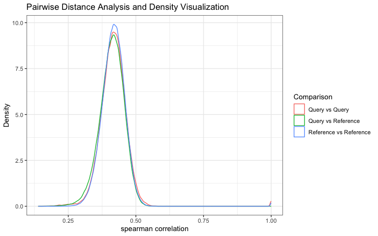

scDiagnostics: diagnostic functions to assess the quality of cell type annotations in single-cell RNA-seq data
================

# Purpose

Annotation transfer from a reference dataset for the cell type
annotation of a new query single-cell RNA-sequencing (scRNA-seq)
experiment is an integral component of the typical analysis
workflow. The approach provides a fast, automated, and reproducible
alternative to the manual annotation of cell clusters based on marker
gene expression. However, dataset imbalance and undiagnosed
incompatibilities between query and reference dataset can lead to
erroneous annotation and distort downstream applications.

The `scDiagnostics` package provides functionality for the systematic
evaluation of cell type assignments in scRNA-seq data.
`scDiagnostics` offers a suite of diagnostic functions to assess
whether both (query and reference) datasets are aligned, ensuring that
annotations can be transferred reliably. `scDiagnostics` also provides
functionality to assess annotation ambiguity, cluster heterogeneity,
and marker gene alignment. The implemented functionality helps
researchers to determine how accurately cells from a new scRNA-seq
experiment can be assigned to known cell types.

# Installation

To install the development version of the package from GitHub use the
following command:

``` r
BiocManager::install("ccb-hms/scDiagnostics")
```

NOTE: you will need the
[remotes](https://cran.r-project.org/web/packages/remotes/index.html)
package to install from GitHub.

To build the package vignettes upon installation use:

``` r
BiocManager::install("ccb-hms/scDiagnostics",
                     build_vignettes = TRUE,
                     dependencies = TRUE)
```

# Usage

To explore the capabilities of the scDiagnostics package, you can load
your own data or utilize publicly available datasets obtained from the
scRNAseq R package. In this guide, we will demonstrate how to use
scDiagnostics with such datasets, which serve as valuable resources
for exploring the package and assessing the appropriateness of cell
type assignments.

``` r
## Loading libraries
library(scDiagnostics)
library(scater)
library(scran)
library(scRNAseq)
library(RColorBrewer)
library(SingleR)
library(AUCell)
library(corrplot)
library(celldex)
```

## Exploratory Analysis: QC Stats vs. Annotation Scores

Here, we will consider the Human Primary Cell Atlas (Mabbott et
al. 2013) as a reference dataset and our query dataset consists of
Haematopoietic stem and progenitor cells from (Bunis DG et al. 2021).

In scRNA-seq studies, assessing the quality of cells is important for
accurate downstream analyses. At the same time, assigning accurate
cell type labels based on gene expression profiles is an integral
aspect of scRNA-seq data interpretation. Generally, these two are
performed independently of each other. The rationale behind this
function is to inspect whether certain QC (Quality Control) criteria
impact the confidence level of cell type annotations.

For instance, it is reasonable to hypothesize that higher library
sizes could contribute to increased annotation confidence due to
enhanced statistical power for identifying cell type-specific gene
expression patterns, as evident in the scatter plot below.

``` r

# load reference dataset
ref_data <- celldex::HumanPrimaryCellAtlasData()

# Load query dataset (Bunis haematopoietic stem and progenitor cell data) from 
# Bunis DG et al. (2021). Single-Cell Mapping of Progressive Fetal-to-Adult 
# Transition in Human Naive T Cells Cell Rep. 34(1): 108573
query_data <- BunisHSPCData()
rownames(query_data) <- rowData(query_data)$Symbol

# Add QC metrics to query data
query_data <- addPerCellQCMetrics(query_data)

# Log transform query dataset
query_data <- logNormCounts(query_data)

# Run SingleR to predict cell types
pred <- SingleR(query_data, ref_data, labels = ref_data$label.main)

# Assign predicted labels to query data
colData(query_data)$pred.labels <- pred$labels

# Get annotation scores
scores <- apply(pred$scores, 1, max)

# Assign scores to query data
colData(query_data)$cell_scores <- scores

# Create a scatter plot between library size and annotation scores
p1 <- plotQCvsAnnotation(
    query_data = query_data,
    qc_col = "total",
    label_col = "pred.labels",
    score_col = "cell_scores",
    label = NULL
)
p1 + xlab("Library Size")
```


However, certain QC metrics, such as the proportion of mitochondrial
genes, may require careful consideration as they can sometimes be
associated with cellular states or functions rather than noise. The
interpretation of mitochondrial content should be context-specific and
informed by biological knowledge.

In next analysis, we investigated the relationship between
mitochondrial percentage and cell type annotation scores using liver
tissue data from He S et al. 2020. Notably, we observed high
annotation scores for macrophages and monocytes. These findings align
with the established biological characteristic of high mitochondrial
activity in macrophages and monocytes, adding biological context to
our results.

``` r
# load query dataset
query_data <- HeOrganAtlasData(
    tissue = c("Liver"),
    ensembl = FALSE,
    location = TRUE
)

# Add QC metrics to query data
mito_genes <- rownames(query_data)[grep("^MT-", rownames(query_data))]
query_data <- unfiltered <- addPerCellQC(query_data,subsets = list(mt = mito_genes))
qc <- quickPerCellQC(colData(query_data),sub.fields="subsets_mt_percent")
query_data <- query_data[,!qc$discard]

# Log transform query dataset
query_data <- logNormCounts(query_data)

# Run SingleR to predict cell types
pred <- SingleR(query_data, ref_data, labels = ref_data$label.main)

# Assign predicted labels to query data
colData(query_data)$pred.labels <- pred$labels

# Calculate cell scores
# Get annotation scores
scores <- apply(pred$scores, 1, max)

# Assign scores to query data
colData(query_data)$cell_scores <- scores

# Create a new column for the labels so it is easy to distinguish
#  between Macrophoges, Monocytes and other cells
query_data$label_category <- ifelse(query_data$pred.labels %in% c("Macrophage", "Monocyte"),
                                     query_data$pred.labels,
                                     "Other cells")


# Define custom colors for cell type labels
cols <- c("Other cells" = "grey", "Macrophage" = "green", "Monocyte" = "red")

# Generate scatter plot for all cell types
p1 <- plotQCvsAnnotation(
    query_data = query_data,
    qc_col = "subsets_mt_percent",
    label_col = "label_category",
    score_col = "cell_scores",
    label = NULL) + 
    scale_color_manual(values = cols) +
    xlab("subsets_mt_percent")
p1
```



## Examining Distribution of QC stats and Annotation Scores

In addition to the scatter plot, we can gain further insights into the
gene expression profiles by visualizing the distribution of user
defined QC stats and annotation scores for all the cell types or
specific cell types. This allows us to examine the variation and
patterns in expression levels and scores across cells assigned to the
cell type of interest.

To accomplish this, we create two separate histograms. The first
histogram displays the distribution of the annotation scores.

The second histogram visualizes the distribution of QC stats. This
provides insights into the overall gene expression levels for the
specific cell type. Here in this particular example we are
investigating percentage of mitochondrial genes.

By examining the histograms, we can observe the range, shape, and
potential outliers in the distribution of both annotation scores and
QC stats. This allows us to assess the appropriateness of the cell
type assignments and identify any potential discrepancies or patterns
in the gene expression profiles for the specific cell type.

``` r
# Generate histogram
histQCvsAnnotation(query_data = query_data, qc_col = "subsets_mt_percent", 
                   label_col = "pred.labels", 
                   score_col = "cell_scores", 
                   label = NULL)
```



The right-skewed distribution for mitochondrial percentages and a
left-skewed distribution for annotation scores in above histograms
suggest that most cells have lower mitochondrial contamination and
higher confidence in their assigned cell types.

## Exploring Gene Expression Distribution

This function helps user to explore the distribution of gene
expression values for a specific gene of interest across all the cells
in both reference and query datasets and within specific cell
types. This helps to evaluate whether the distributions are similar or
aligned between the datasets. Discrepancies in distribution patterns
may indicate potential incompatibilities or differences between the
datasets.

The function also allows users to narrow down their analysis to
specific cell types of interest. This enables investigation of whether
alignment between the query and reference datasets is consistent not
only at a global level but also within specific cell types.

``` r

# Load data
sce <- HeOrganAtlasData(tissue = c("Marrow"), ensembl = FALSE)

# Divide the data into reference and query datasets
set.seed(100)
indices <- sample(ncol(assay(sce)), size = floor(0.7 * ncol(assay(sce))), replace = FALSE)
ref_data <- sce[, indices]
query_data <- sce[, -indices]

# Log-transform datasets
ref_data <- logNormCounts(ref_data)
query_data <- logNormCounts(query_data)

# Run PCA
ref_data <- runPCA(ref_data)
query_data <- runPCA(query_data)

# Get cell type scores using SingleR
pred <- SingleR(query_data, ref_data, labels = ref_data$reclustered.broad)
pred <- as.data.frame(pred)
   
# Assign labels to query data
colData(query_data)$labels <- pred$labels
   
# Generate density plots
plotMarkerExpression(reference_data = ref_data, 
                     query_data = query_data, 
                     reference_cell_labels = "reclustered.broad", 
                     query_cell_labels = "labels", 
                     gene_name = "MS4A1", 
                     label = "B_and_plasma")
```



In the provided example, we examined the distribution of expression
values for the gene MS4A1, a marker for naive B cells, in both the
query and reference datasets. Additionally, we also looked at the
distribution of MS4A1 expression in the B_and_plasma cell type. We
observed overlapping distributions in both cases, suggesting alignment
between the reference and query datasets.

## Evaluating Alignment Between Reference and Query Datasets in Terms of Highly Variable Genes

We are assessing the similarity or alignment between two datasets, the
reference dataset, and the query dataset, in terms of highly variable
genes (HVGs). We calculate the overlap coefficient between the sets of
highly variable genes in the reference and query datasets. The overlap
coefficient quantifies the degree of overlap or similarity between
these two sets of genes. A value closer to 1 indicates a higher degree
of overlap, while a value closer to 0 suggests less overlap. The
computed overlap coefficient is printed, providing a numerical measure
of how well the highly variable genes in the reference and query
datasets align. In this case, the overlap coefficient is 0.63,
indicating a moderate level of overlap.

``` r

# Selecting highly variable genes
ref_var <- getTopHVGs(ref_data, n=2000)
query_var <- getTopHVGs(query_data, n=2000)

# Compute the overlap coefficient
overlap_coefficient <- calculateHVGOverlap(reference_genes = ref_var, 
                                           query_genes = query_var)
print(overlap_coefficient)
#> [1] 0.63
```

This analysis helps us assess the extent to which the reference and
query datasets share highly variable genes, which can provide insights
into the comparability and alignment of these datasets.

## Visualize Gene Expression on Dimensional Reduction Plot

To gain insights into the gene expression patterns and their
representation in a dimensional reduction space, we can utilize the
plotGeneExpressionDimred function. This function allows us to plot the
gene expression values of a specific gene on a dimensional reduction
plot generated using methods like t-SNE, UMAP, or PCA. Each single
cell is color-coded based on its expression level of the gene of
interest.

In the provided example, we are visualizing the gene expression values
of the gene “VPREB3” on a PCA plot. The PCA plot represents the cells
in a lower-dimensional space, where the x-axis corresponds to the
first principal component (Dimension 1) and the y-axis corresponds to
the second principal component (Dimension 2). Each cell is represented
as a point on the plot, and its color reflects the expression level of
the gene “VPREB3,” ranging from low (lighter color) to high (darker
color).

``` r
# Generate dimension reduction plot color code by gene expression
plotGeneExpressionDimred(se_object = query_data, 
                         method = "PCA", 
                         n_components = c(1, 2), 
                         feature = "VPREB3")
```


The dimensional reduction plot allows us to observe how the gene
expression of VPREB3 is distributed across the cells and whether any
clusters or patterns emerge in the data.

## Visualize Gene Sets or Pathway Scores on Dimensional Reduction Plot

In addition to examining individual gene expression patterns, it is
often useful to assess the collective activity of gene sets or
pathways within single cells. This can provide insights into the
functional states or biological processes associated with specific
cell types or conditions. To facilitate this analysis, the
scDiagnostics package includes a function called plotGeneSetScores
that enables the visualization of gene set or pathway scores on a
dimensional reduction plot.

The plotGeneSetScores function allows you to plot gene set or pathway
scores on a dimensional reduction plot generated using methods such as
PCA, t-SNE, or UMAP. Each single cell is color-coded based on its
scores for specific gene sets or pathways. This visualization helps
identify the heterogeneity and patterns of gene set or pathway
activity within the dataset, potentially revealing subpopulations with
distinct functional characteristics.

``` r

# Compute scores using AUCell
expression_matrix <- assay(query_data, "logcounts")
cells_rankings <- AUCell_buildRankings(expression_matrix, plotStats = F)

# Generate gene sets
gene_set1 <- sample(rownames(expression_matrix), 10)
gene_set2 <- sample(rownames(expression_matrix), 20)

gene_sets <- list(geneSet1 = gene_set1,
                  geneSet2 = gene_set2)

# Calculate AUC scores for gene sets
cells_AUC <- AUCell_calcAUC(gene_sets, cells_rankings)

# Assign scores to colData
colData(query_data)$geneSetScores <- assay(cells_AUC)["geneSet1", ]

# Plot gene set scores on PCA
plotGeneSetScores(se_object = query_data, 
                  method = "PCA", 
                  feature = "geneSetScores")
```



In the provided example, we demonstrate the usage of the
plotGeneSetScores function using the AUCell package to compute gene
set or pathway scores. Custom gene sets are generated for
demonstration purposes, but users can provide their own gene set
scores using any method of their choice. It is important to ensure
that the scores are assigned to the colData of the reference or query
object and specify the correct feature name for visualization.

By visualizing gene set or pathway scores on a dimensional reduction
plot, you can gain a comprehensive understanding of the functional
landscape within your single-cell gene expression dataset and explore
the relationships between gene set activities and cellular phenotypes.

## Visualizing Reference and Query Cell Types using Multidimensional Scaling (MDS)

This function performs Multidimensional Scaling (MDS) analysis on the
query and reference datasets to examine their similarity. The
dissimilarity matrix is calculated based on the correlation between
the datasets, representing the distances between cells in terms of
gene expression patterns. MDS is then applied to derive
low-dimensional coordinates for each cell. Subsequently, a scatter
plot is generated, where each data point represents a cell, and cell
types are color-coded using custom colors provided by the user. This
visualization enables the comparison of cell type distributions
between the query and reference datasets in a reduced-dimensional
space.

The rationale behind this function is to visually assess the alignment
and relationships between cell types in the query and reference
datasets.

``` r

# Intersect the gene symbols to obtain common genes
common_genes <- intersect(ref_var, query_var)

# Select desired cell types
selected_cell_types <- c("CD4", "CD8", "B_and_plasma")
ref_data_subset <- ref_data[common_genes, ref_data$reclustered.broad %in% selected_cell_types]
query_data_subset <- query_data[common_genes, query_data$labels %in% selected_cell_types]

# Extract cell types for visualization
ref_labels <- ref_data_subset$reclustered.broad
query_labels <- query_data_subset$labels

# Combine the cell type labels from both datasets
mdata <- c(paste("Query", query_labels), paste("Reference", ref_labels))

## Define the cell types and legend order
cell_types <- c("Query CD8", "Reference CD8", "Query CD4", "Reference CD4", "Query B_and_plasma", "Reference B_and_plasma")
legend_order <- cell_types

## Define the colors for cell types
color_palette <- brewer.pal(length(cell_types), "Paired")
color_mapping <- setNames(color_palette, cell_types)
cell_type_colors <- color_mapping[cell_types]

## Generate the MDS scatter plot with cell type coloring
visualizeCellTypeMDS(query_data = query_data_subset, 
                     reference_data = ref_data_subset, 
                     mdata = mdata, 
                     cell_type_colors = cell_type_colors, 
                     legend_order = legend_order)
```



Upon examining the MDS scatter plot, we observe that the CD4 and CD8
cell types overlap to some extent.By observing the proximity or
overlap of different cell types, one can gain insights into their
potential relationships or shared characteristics.

The selection of custom genes and desired cell types depends on the
user’s research interests and goals. It allows for flexibility in
focusing on specific genes and examining particular cell types of
interest in the visualization.

## Cell Type-specific Pairwise Correlation Analysis and Visualization

This analysis aims to explore the correlation patterns between
different cell types in a single-cell gene expression dataset. The
goal is to compare the gene expression profiles of cells from a
reference dataset and a query dataset to understand the relationships
and similarities between various cell types.

To perform the analysis, we start by computing the pairwise
correlations between the query and reference cells for selected cell
types (“CD4”, “CD8”, “B_and_plasma”). The Spearman correlation method
is used, user can also use Pearsons correlation coeefficient.

This will return average correlation matrix which can be visulaized by
user’s method of choice. Here, the results are visualized as a
correlation plot using the corrplot package.

``` r
selected_cell_types <- c("CD4", "CD8", "B_and_plasma")
cor_matrix_avg <- computeAveragePairwiseCorrelation(query_data = query_data_subset, 
                                                    reference_data = ref_data_subset, 
                                                    query_cell_type_col = "labels", 
                                                    ref_cell_type_col = "reclustered.broad", 
                                                    cell_types = selected_cell_types, 
                                                    correlation_method = "spearman")

# Plot the pairwise average correlations using corrplot
corrplot(cor_matrix_avg, method = "number", tl.col = "black")
```



In this case, users have the flexibility to extract the gene
expression profiles of specific cell types from the reference and
query datasets and provide these profiles as input to the
function. Additionally, they can select their own set of genes that
they consider relevant for computing the pairwise correlations. For
demonstartion we have used common highly variable genes from reference
and query dataset.

By providing their own gene expression profiles and choosing specific
genes, users can focus the analysis on the cell types and genes of
interest to their research question.

## Pairwise Distance Analysis and Density Visualization

This function serves to conduct a analysis of pairwise distances or
correlations between cells of specific cell types within a single-cell
gene expression dataset. By calculating these distances or
correlations, users can gain insights into the relationships and
differences in gene expression profiles between different cell
types. The function facilitates this analysis by generating density
plots, allowing users to visualize the distribution of distances or
correlations for various pairwise comparisons.

The analysis offers the flexibility to select a particular cell type
for examination, and users can choose between different distance
metrics, such as “euclidean” or “manhattan,” to calculate pairwise
distances.

To illustrate, the function is applied to the cell type CD8 using the
euclidean distance metric in the example below.

``` r
calculatePairwiseDistancesAndPlotDensity(query_data = query_data_subset, 
                                         reference_data = ref_data_subset, 
                                         query_cell_type_col = "labels", 
                                         ref_cell_type_col = "reclustered.broad", 
                                         cell_type_query = "CD8", 
                                         cell_type_reference = "CD8", 
                                         distance_metric = "euclidean")
```



Alternatively, users can opt for the “correlation” distance metric,
which measures the similarity in gene expression profiles between
cells.

To illustrate, the function is applied to the cell type CD8 using the
correlation distance metric in the example below. By selecting either
the “pearson” or “spearman” correlation method, users can emphasize
either linear or rank-based associations, respectively.

``` r
calculatePairwiseDistancesAndPlotDensity(query_data = query_data_subset, 
                                         reference_data = ref_data_subset, 
                                         query_cell_type_col = "labels", 
                                         ref_cell_type_col = "reclustered.broad", 
                                         cell_type_query = "CD8", 
                                         cell_type_reference = "CD8", 
                                         distance_metric = "correlation",
                                         correlation_method = "spearman")
```



By utilizing this function, users can explore the pairwise distances
between query and reference cells of a specific cell type and gain
insights into the distribution of distances through density
plots. This analysis aids in understanding the similarities and
differences in gene expression profiles for the selected cell type
within the query and reference datasets.

## Linear regression analysis

Performing linear regression analysis on a SingleCellExperiment object
enables users to examine the relationship between a principal
component (PC) from the dimension reduction slot and an independent
variable of interest. By specifying the desired dependent variable as
one of the principal components (e.g., “PC1”, “PC2”, etc.) and
providing the corresponding independent variable from the colData
slot, users can explore the associations between these variables
within the single-cell gene expression dataset (reference and query).

``` r
# Specify the dependent variables (principal components) and independent variable (e.g., "labels")
dep.vars <- c("PC1", "PC2", "PC3")
indep.var <- "labels"

# Perform linear regression on multiple principal components
result <- regressPC(sce = query_data, dep.vars = dep.vars, indep.var = indep.var)

# Summaries of the linear regression models
print(result$regression_summaries)
#> NULL

# R-squared values
print(result$rsquared_df)
#> NULL

# Variance contributions for each principal component
print(result$var_contributions_df)
#> NULL

# Total variance explained
print(result$total_variance_explained)
#> NULL
```

By conducting linear regression, one can assess whether the PC values
are significantly associated with the cell types. This analysis helps
uncover whether there is a systematic variation in PC values across
different cell types. Understanding the relationship between PC values
and cell types can provide valuable insights into the biological or
technical factors driving cellular heterogeneity. It can help identify
PC dimensions that capture variation specific to certain cell types or
distinguish different cellular states.

# Conclusion

In this analysis, we have demonstrated the capabilities of the
scDiagnostics package for assessing the appropriateness of cell
assignments in single-cell gene expression profiles. By utilizing
various diagnostic functions and visualization techniques, we have
explored different aspects of the data, including total UMI counts,
annotation scores, gene expression distributions, dimensional
reduction plots, gene set scores, pairwise correlations, pairwise
distances, and linear regression analysis.

Through the scatter plots, histograms, and dimensional reduction
plots, we were able to gain insights into the relationships between
gene expression patterns, cell types, and the distribution of cells in
a reduced-dimensional space. The examination of gene expression
distributions, gene sets, and pathways allowed us to explore the
functional landscape and identify subpopulations with distinct
characteristics within the dataset. Additionally, the pairwise
correlation and distance analyses provided a deeper understanding of
the similarities and differences between cell types, highlighting
potential relationships and patterns.

------------------------------------------------------------------------

## R.session Info

    R version 4.3.1 (2023-06-16)
    Platform: aarch64-apple-darwin20 (64-bit)
    Running under: macOS Sonoma 14.2

    Matrix products: default
    BLAS:   /Library/Frameworks/R.framework/Versions/4.3-arm64/Resources/lib/libRblas.0.dylib 
    LAPACK: /Library/Frameworks/R.framework/Versions/4.3-arm64/Resources/lib/libRlapack.dylib;  LAPACK version 3.11.0

    locale:
    [1] en_US.UTF-8/en_US.UTF-8/en_US.UTF-8/C/en_US.UTF-8/en_US.UTF-8

    time zone: America/New_York
    tzcode source: internal

    attached base packages:
    [1] stats4    stats     graphics  grDevices utils     datasets  methods  
    [8] base     

    other attached packages:
     [1] celldex_1.10.1              corrplot_0.92              
     [3] AUCell_1.22.0               SingleR_2.2.0              
     [5] RColorBrewer_1.1-3          scRNAseq_2.14.0            
     [7] scran_1.28.2                scater_1.29.2              
     [9] ggplot2_3.4.4               scuttle_1.10.3             
    [11] scDiagnostics_0.99.0        SingleCellExperiment_1.22.0
    [13] SummarizedExperiment_1.30.2 Biobase_2.60.0             
    [15] GenomicRanges_1.52.1        GenomeInfoDb_1.36.4        
    [17] IRanges_2.34.1              S4Vectors_0.38.2           
    [19] BiocGenerics_0.46.0         MatrixGenerics_1.12.3      
    [21] matrixStats_1.0.0          

    loaded via a namespace (and not attached):
      [1] rstudioapi_0.15.0             magrittr_2.0.3               
      [3] ggbeeswarm_0.7.2              GenomicFeatures_1.52.2       
      [5] farver_2.1.1                  rmarkdown_2.25               
      [7] BiocIO_1.10.0                 zlibbioc_1.46.0              
      [9] vctrs_0.6.4                   Rsamtools_2.16.0             
     [11] memoise_2.0.1                 DelayedMatrixStats_1.22.6    
     [13] RCurl_1.98-1.12               htmltools_0.5.6.1            
     [15] S4Arrays_1.0.6                progress_1.2.2               
     [17] AnnotationHub_3.8.0           curl_5.1.0                   
     [19] BiocNeighbors_1.18.0          cachem_1.0.8                 
     [21] GenomicAlignments_1.36.0      igraph_1.5.1                 
     [23] mime_0.12                     lifecycle_1.0.3              
     [25] pkgconfig_2.0.3               rsvd_1.0.5                   
     [27] Matrix_1.6-1.1                R6_2.5.1                     
     [29] fastmap_1.1.1                 GenomeInfoDbData_1.2.10      
     [31] shiny_1.7.5.1                 digest_0.6.33                
     [33] colorspace_2.1-0              AnnotationDbi_1.62.2         
     [35] dqrng_0.3.1                   irlba_2.3.5.1                
     [37] ExperimentHub_2.8.1           RSQLite_2.3.1                
     [39] beachmat_2.16.0               labeling_0.4.3               
     [41] filelock_1.0.2                fansi_1.0.5                  
     [43] httr_1.4.7                    abind_1.4-5                  
     [45] compiler_4.3.1                bit64_4.0.5                  
     [47] withr_2.5.1                   BiocParallel_1.34.2          
     [49] viridis_0.6.4                 DBI_1.1.3                    
     [51] R.utils_2.12.2                biomaRt_2.56.1               
     [53] rappdirs_0.3.3                DelayedArray_0.26.7          
     [55] rjson_0.2.21                  bluster_1.10.0               
     [57] tools_4.3.1                   vipor_0.4.5                  
     [59] beeswarm_0.4.0                interactiveDisplayBase_1.38.0
     [61] httpuv_1.6.12                 R.oo_1.25.0                  
     [63] glue_1.6.2                    restfulr_0.0.15              
     [65] promises_1.2.1                grid_4.3.1                   
     [67] cluster_2.1.4                 generics_0.1.3               
     [69] gtable_0.3.4                  R.methodsS3_1.8.2            
     [71] ensembldb_2.24.1              data.table_1.14.8            
     [73] hms_1.1.3                     xml2_1.3.5                   
     [75] BiocSingular_1.16.0           ScaledMatrix_1.8.1           
     [77] metapod_1.8.0                 utf8_1.2.4                   
     [79] XVector_0.40.0                ggrepel_0.9.4                
     [81] BiocVersion_3.17.1            pillar_1.9.0                 
     [83] stringr_1.5.0                 limma_3.56.2                 
     [85] later_1.3.1                   dplyr_1.1.3                  
     [87] BiocFileCache_2.8.0           lattice_0.22-5               
     [89] rtracklayer_1.60.1            bit_4.0.5                    
     [91] annotate_1.78.0               tidyselect_1.2.0             
     [93] locfit_1.5-9.8                Biostrings_2.68.1            
     [95] knitr_1.44                    gridExtra_2.3                
     [97] ProtGenerics_1.32.0           edgeR_3.42.4                 
     [99] xfun_0.40                     statmod_1.5.0                
    [101] stringi_1.7.12                lazyeval_0.2.2               
    [103] yaml_2.3.7                    evaluate_0.22                
    [105] codetools_0.2-19              tibble_3.2.1                 
    [107] graph_1.78.0                  BiocManager_1.30.22          
    [109] cli_3.6.1                     xtable_1.8-4                 
    [111] munsell_0.5.0                 Rcpp_1.0.11                  
    [113] dbplyr_2.3.4                  png_0.1-8                    
    [115] XML_3.99-0.14                 parallel_4.3.1               
    [117] ellipsis_0.3.2                blob_1.2.4                   
    [119] prettyunits_1.2.0             AnnotationFilter_1.24.0      
    [121] sparseMatrixStats_1.12.2      bitops_1.0-7                 
    [123] GSEABase_1.62.0               viridisLite_0.4.2            
    [125] scales_1.2.1                  purrr_1.0.2                  
    [127] crayon_1.5.2                  rlang_1.1.1                  
    [129] cowplot_1.1.1                 KEGGREST_1.40.1              
