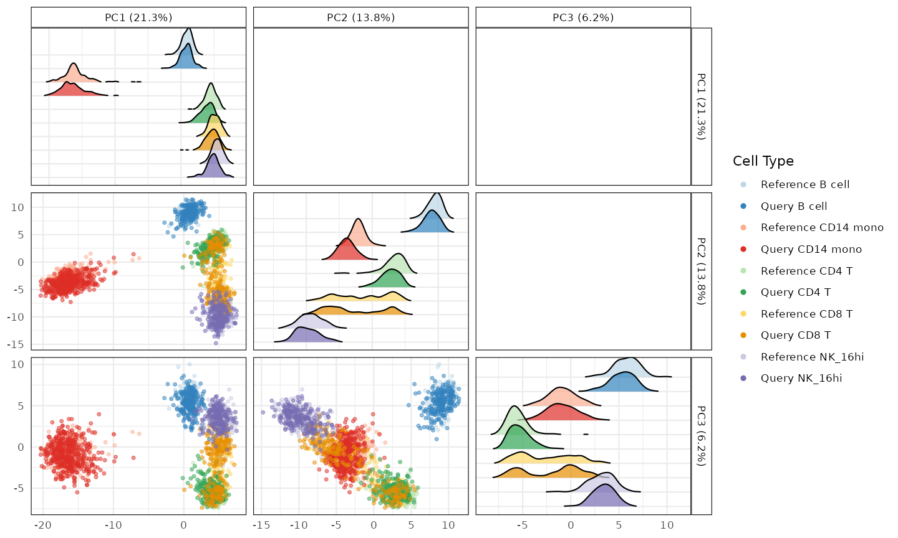
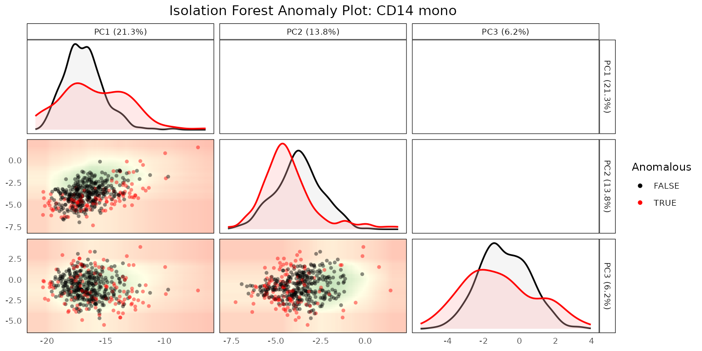
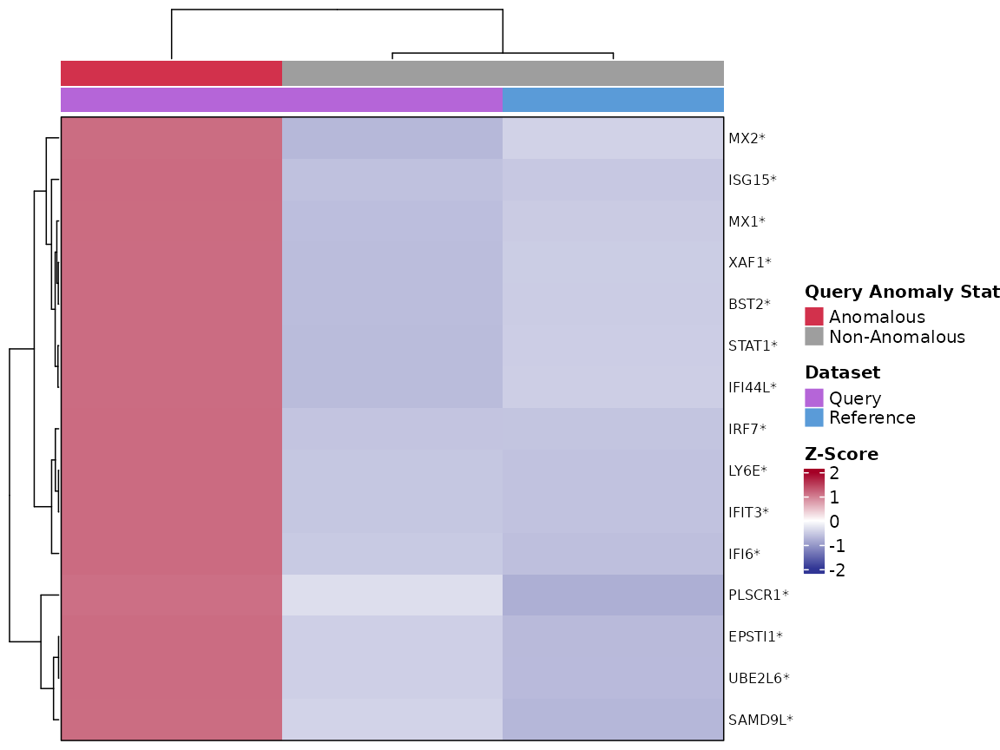
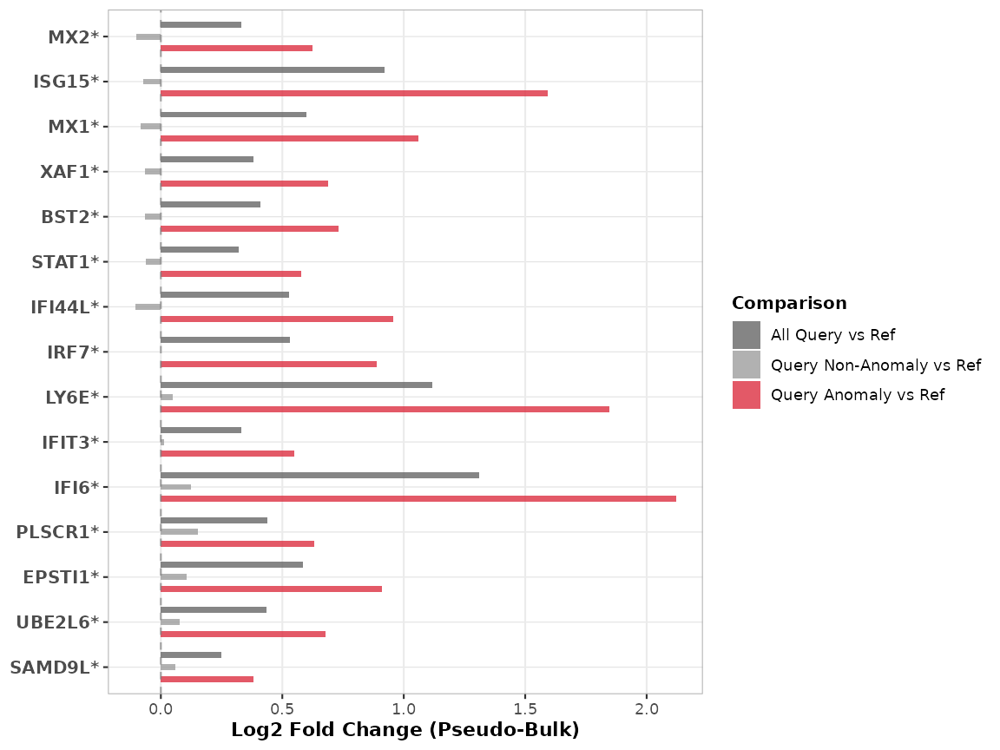

# 3. Case Study: A Disease-Associated Monocyte State in COVID-19

## Purpose

This vignette walks through the project-detect-characterize workflow
introduced in [vignette
1](https://ccb-hms.github.io/scDiagnostics/articles/Introduction.html)
on a real disease case study: PBMC scRNA-seq data from healthy donors
(reference) and donors with severe COVID-19 (query), from Stephenson et
al. (2021). The goal is to find out whether CD14 monocytes in the
severe-COVID query look like a distinct state relative to the healthy
reference, and if so, what distinguishes them.

``` r

library(scDiagnostics)
library(SingleCellExperiment)

set.seed(100)
```

## The data

`covid_reference_data` (healthy donors) and `covid_query_data` (severe
COVID-19 donors) are downsampled subsets of the Stephenson et al. (2021)
PBMC atlas, restricted to 5 shared cell types and a gene panel that
always includes a 25-gene interferon-response signature (Yoshida et
al.); see
[`?covid_reference_data`](https://ccb-hms.github.io/scDiagnostics/reference/covid_reference_data.md)
for the full processing details.

``` r

data("covid_reference_data")
data("covid_query_data")

table(covid_reference_data$author_cell_type_merged)
#> 
#>    B cell CD14 mono     CD4 T     CD8 T   NK_16hi 
#>       180       180       180       180       180
table(covid_query_data$azimuth_celltype_l1_merged)
#> 
#>    B cell CD14 mono     CD4 T     CD8 T   NK_16hi 
#>       220       450       220       220       220
```

The reference’s cell type column (`author_cell_type_merged`) reflects
the original authors’ annotation; the query’s
(`azimuth_celltype_l1_merged`) comes from Azimuth reference mapping.
Both were computed independently of `scDiagnostics` - we are auditing an
annotation transfer that has already happened, not producing one.

## Step 1: project

[`plotCellTypePCA()`](https://ccb-hms.github.io/scDiagnostics/reference/plotCellTypePCA.md)
projects the query onto the reference’s PCA space and compares the
distributions of each cell type along the leading PCs:

``` r

shared_cell_types <- c("CD14 mono", "CD4 T", "CD8 T", "B cell", "NK_16hi")

plotCellTypePCA(
    query_data = covid_query_data,
    reference_data = covid_reference_data,
    cell_types = shared_cell_types,
    query_cell_type_col = "azimuth_celltype_l1_merged",
    ref_cell_type_col = "author_cell_type_merged",
    pc_subset = 1:3)
#> Picking joint bandwidth of 0.304
#> Picking joint bandwidth of 0.589
#> Picking joint bandwidth of 0.491
```



## Step 2: detect

Focusing specifically on CD14 monocytes,
[`detectAnomaly()`](https://ccb-hms.github.io/scDiagnostics/reference/detectAnomaly.md)
builds an Isolation Forest on the reference’s PCA projection and scores
how anomalous each query cell looks relative to it:

``` r

anomaly_output <- detectAnomaly(
    reference_data = covid_reference_data,
    query_data = covid_query_data,
    ref_cell_type_col = "author_cell_type_merged",
    query_cell_type_col = "azimuth_celltype_l1_merged",
    cell_types = "CD14 mono",
    pc_subset = 1:5,
    n_tree = 500)

mean(anomaly_output[["CD14 mono"]]$query_anomaly)
#> [1] 0.2733333
```

``` r

plot(anomaly_output, cell_type = "CD14 mono", pc_subset = 1:3, data_type = "query")
```



In this downsampled dataset, a substantial fraction of the query’s CD14
monocytes are flagged as anomalous relative to the healthy reference.
Unlike the rare/withheld-cell-type scenarios in [vignette
2](https://ccb-hms.github.io/scDiagnostics/articles/ZeiselBenchmarking.html),
this is not necessarily a small, rare subpopulation - a disease process
can plausibly shift a large fraction of a cell type’s expression
profile, and that is a hypothesis worth checking directly rather than
assuming anomaly detection here means the same thing it did there.

## Step 3: characterize

[`calculateGeneShifts()`](https://ccb-hms.github.io/scDiagnostics/reference/calculateGeneShifts.md)
tests each gene in a specified panel for a distributional shift between
reference and query, optionally comparing only the non-anomalous
reference cells against the anomalous query cells
(`anomaly_comparison = TRUE`). We focus this on the 25-gene Yoshida et
al. interferon-response signature already included in the gene panel of
both objects:

``` r

yoshida_ifn_signature <- c(
    "BST2", "CMPK2", "EIF2AK2", "EPSTI1", "HERC5", "IFI35", "IFI44L",
    "IFI6", "IFIT3", "ISG15", "LY6E", "MX1", "MX2", "OAS1", "OAS2",
    "PARP9", "PLSCR1", "SAMD9", "SAMD9L", "SP110", "STAT1", "TRIM22",
    "UBE2L6", "XAF1", "IRF7")

gene_shifts <- calculateGeneShifts(
    query_data = covid_query_data[yoshida_ifn_signature, ],
    reference_data = covid_reference_data[yoshida_ifn_signature, ],
    query_cell_type_col = "azimuth_celltype_l1_merged",
    ref_cell_type_col = "author_cell_type_merged",
    cell_types = "CD14 mono",
    pc_subset = 1:5,
    n_top_loadings = 25,
    detect_anomalies = TRUE,
    anomaly_comparison = TRUE)
#> Warning in fitTrendVar(fm, fv, ...): 'fitTrendVar' is deprecated.
#> Use 'scrapper::fitVarianceTrend' instead.
#> See help("Deprecated")
#> Warning in combineBlocks(collected, method = method, equiweight = equiweight, : 'combineBlocks' is deprecated.
#> See help("Deprecated")
#> Warning in scran::getTopHVGs(var_stats, n = n_hvgs): 'scran::getTopHVGs' is deprecated.
#> Use 'scrapper::chooseHighlyVariableGenes' instead.
#> See help("Deprecated")
#> Warning in check_numbers(x, k = k, nu = nu, nv = nv): more singular
#> values/vectors requested than available

head(gene_shifts$PC1[order(gene_shifts$PC1$p_adjusted), ], 10)
#>      gene      loading cell_type p_value mean_query mean_reference p_adjusted
#> 1    LY6E  0.017244450 CD14 mono       0  2.7398890     0.80911272          0
#> 2    IFI6 -0.014406456 CD14 mono       0  2.6754521     0.47198159          0
#> 3    BST2 -0.012502318 CD14 mono       0  1.6340352     0.82511624          0
#> 4    IRF7 -0.011014061 CD14 mono       0  1.3113019     0.39981541          0
#> 5     MX2 -0.010216540 CD14 mono       0  0.9759931     0.28497303          0
#> 6     MX1 -0.008912552 CD14 mono       0  1.3944989     0.24070821          0
#> 7  IFI44L -0.007559699 CD14 mono       0  1.1655427     0.13011109          0
#> 8   ISG15 -0.006431524 CD14 mono       0  2.0172213     0.29153589          0
#> 9  EPSTI1 -0.004185579 CD14 mono       0  1.1093122     0.13667800          0
#> 10  IFIT3 -0.003400604 CD14 mono       0  0.6571842     0.04993755          0
#>    significant
#> 1         TRUE
#> 2         TRUE
#> 3         TRUE
#> 4         TRUE
#> 5         TRUE
#> 6         TRUE
#> 7         TRUE
#> 8         TRUE
#> 9         TRUE
#> 10        TRUE
```

The genes with the smallest adjusted p-values here (e.g. `IFI6`, `LY6E`,
`BST2`) are all canonical interferon-stimulated genes, each with
substantially higher mean expression in the anomalous query cells than
in the non-anomalous reference cells.
[`plot()`](https://rdrr.io/r/graphics/plot.default.html) visualizes this
as a heatmap of per-gene z-scores:

``` r

plot(gene_shifts, cell_type = "CD14 mono", pc_subset = 1:5,
    plot_type = "heatmap", plot_by = "p_adjusted", n_genes = 15,
    show_anomalies = TRUE, pseudo_bulk = TRUE, cluster_cols = TRUE)
```



or as fold-changes relative to the reference:

``` r

plot(gene_shifts, cell_type = "CD14 mono", pc_subset = 1:5,
    plot_type = "barplot", plot_by = "p_adjusted", n_genes = 15,
    show_anomalies = TRUE, pseudo_bulk = TRUE)
```



Together, these three steps give a concrete, checkable answer: yes, CD14
monocytes in the severe-COVID query look different from the healthy
reference in PCA space,
[`detectAnomaly()`](https://ccb-hms.github.io/scDiagnostics/reference/detectAnomaly.md)
flags a large fraction of them accordingly, and the genes distinguishing
the flagged cells are specifically interferon-response genes -
consistent with a known biological interferon-activated monocyte state
in severe COVID-19, rather than an artifact of the annotation transfer
itself. The original manuscript further shows this same interferon
signature recovered regardless of which of four independent annotation
tools (Azimuth, SingleR, CellTypist, scVI) produced the query labels;
that cross-tool comparison is not reproduced in this vignette.

------------------------------------------------------------------------

## R Session Info

    R version 4.6.1 (2026-06-24)
    Platform: x86_64-pc-linux-gnu
    Running under: Ubuntu 24.04.5 LTS

    Matrix products: default
    BLAS:   /usr/lib/x86_64-linux-gnu/openblas-pthread/libblas.so.3 
    LAPACK: /usr/lib/x86_64-linux-gnu/openblas-pthread/libopenblasp-r0.3.26.so;  LAPACK version 3.12.0

    locale:
     [1] LC_CTYPE=C.UTF-8       LC_NUMERIC=C           LC_TIME=C.UTF-8       
     [4] LC_COLLATE=C.UTF-8     LC_MONETARY=C.UTF-8    LC_MESSAGES=C.UTF-8   
     [7] LC_PAPER=C.UTF-8       LC_NAME=C              LC_ADDRESS=C          
    [10] LC_TELEPHONE=C         LC_MEASUREMENT=C.UTF-8 LC_IDENTIFICATION=C   

    time zone: UTC
    tzcode source: system (glibc)

    attached base packages:
    [1] stats4    stats     graphics  grDevices utils     datasets  methods  
    [8] base     

    other attached packages:
     [1] SingleCellExperiment_1.34.0 SummarizedExperiment_1.42.0
     [3] Biobase_2.72.0              GenomicRanges_1.64.0       
     [5] Seqinfo_1.2.0               IRanges_2.46.0             
     [7] S4Vectors_0.50.3            BiocGenerics_0.58.1        
     [9] generics_0.1.4              MatrixGenerics_1.24.0      
    [11] matrixStats_1.5.0           scDiagnostics_1.7.8        
    [13] BiocStyle_2.40.0           

    loaded via a namespace (and not attached):
      [1] gridExtra_2.3.1       rlang_1.3.0           magrittr_2.0.5       
      [4] clue_0.3-68           GetoptLong_1.1.1      scater_1.40.2        
      [7] otel_0.2.0            ggridges_0.5.7        compiler_4.6.1       
     [10] png_0.1-9             systemfonts_1.3.2     vctrs_0.7.3          
     [13] shape_1.4.6.1         crayon_1.5.3          pkgconfig_2.0.3      
     [16] fastmap_1.2.0         magick_2.9.1          XVector_0.52.0       
     [19] scuttle_1.22.0        labeling_0.4.3        rmarkdown_2.32       
     [22] ggbeeswarm_0.7.3      ragg_1.5.2            purrr_1.2.2          
     [25] xfun_0.61             bluster_1.22.0        cachem_1.1.0         
     [28] beachmat_2.28.0       jsonlite_2.0.0        DelayedArray_0.38.2  
     [31] BiocParallel_1.46.0   irlba_2.3.7           parallel_4.6.1       
     [34] cluster_2.1.8.2       R6_2.6.1              bslib_0.12.0         
     [37] RColorBrewer_1.1-3    limma_3.68.5          GGally_2.4.0         
     [40] jquerylib_0.1.4       Rcpp_1.1.2            bookdown_0.48        
     [43] iterators_1.0.14      knitr_1.52            Matrix_1.7-5         
     [46] igraph_2.3.3          tidyselect_1.2.1      abind_1.4-8          
     [49] yaml_2.3.12           viridis_0.6.5         doParallel_1.0.17    
     [52] codetools_0.2-20      lattice_0.22-9        tibble_3.3.1         
     [55] withr_3.0.3           S7_0.2.2              evaluate_1.0.5       
     [58] desc_1.4.3            ggstats_0.14.0        circlize_0.4.18      
     [61] pillar_1.11.1         BiocManager_1.30.27   foreach_1.5.2        
     [64] ggplot2_4.0.3         scales_1.4.0          RhpcBLASctl_0.23-42  
     [67] glue_1.8.1            metapod_1.20.0        tools_4.6.1          
     [70] BiocNeighbors_2.6.0   ScaledMatrix_1.20.0   locfit_1.5-9.12      
     [73] fs_2.1.0              scran_1.40.0          grid_4.6.1           
     [76] tidyr_1.3.2           colorspace_2.1-3      edgeR_4.10.5         
     [79] beeswarm_0.4.0        BiocSingular_1.28.0   vipor_0.4.7          
     [82] cli_3.6.6             rsvd_1.0.5            textshaping_1.0.5    
     [85] S4Arrays_1.12.0       viridisLite_0.4.3     ComplexHeatmap_2.28.0
     [88] dplyr_1.2.1           gtable_0.3.6          isotree_0.6.1-5      
     [91] sass_0.4.10           digest_0.6.39         SparseArray_1.12.2   
     [94] ggrepel_0.9.8         dqrng_0.4.1           rjson_0.2.23         
     [97] htmlwidgets_1.6.4     farver_2.1.2          htmltools_0.5.9      
    [100] pkgdown_2.2.1         lifecycle_1.0.5       GlobalOptions_0.1.4  
    [103] statmod_1.5.2        
