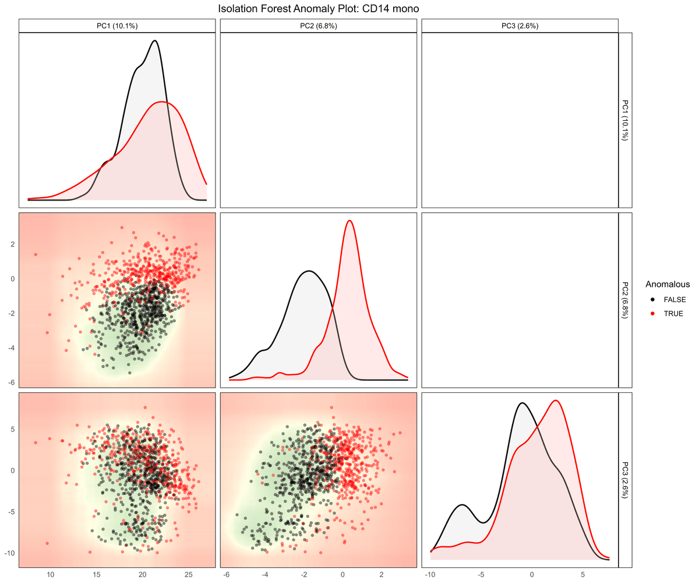
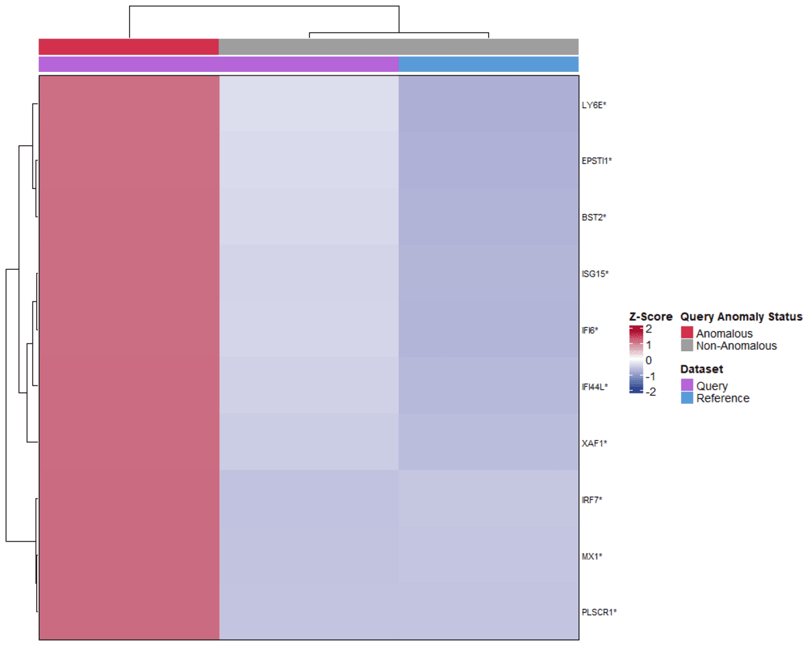
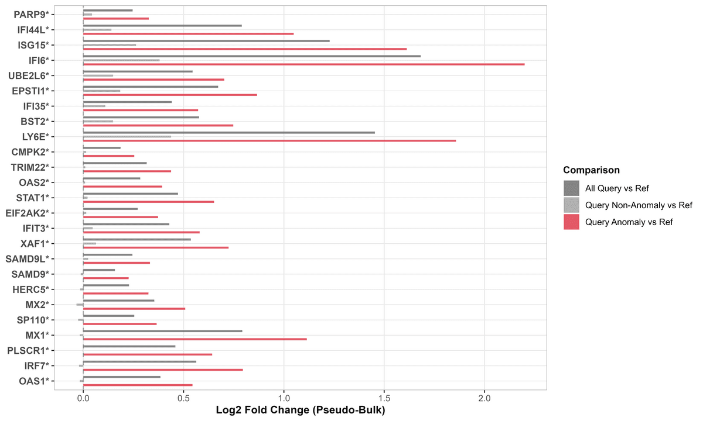
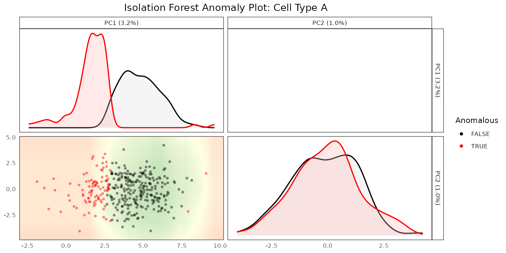

# 1. Introduction to \`scDiagnostics\`

## Purpose

Automated cell type annotation - transferring labels from a reference
dataset onto a new query dataset - is now a routine step in single-cell
RNA-seq (scRNA-seq) analysis. It is fast and reproducible, but it is
only as trustworthy as the alignment between reference and query: batch
effects, cell states missing from the reference, or systematic
differences in sequencing depth can all produce confidently-labeled
cells that are, in fact, misannotated.

`scDiagnostics` provides diagnostics for exactly this problem. Rather
than another annotation method, it is a toolkit for **auditing**
annotations you already have: is the query well-aligned with the
reference in PCA space? Are there cells that look anomalous relative to
their assigned cell type? If so, which genes distinguish them from the
reference? Answering these questions helps decide whether an annotation
transfer can be trusted, and where to look if it cannot.

The package operates on
*[SingleCellExperiment](https://bioconductor.org/packages/3.23/SingleCellExperiment)*
objects and is not specific to scRNA-seq: the same diagnostics apply
directly to spatial data stored as a
`r BiocStyle::Biocpkg("SpatialExperiment")` or
`r BiocStyle::Biocpkg("SpatialFeatureExperiment")` object, without any
modification, since both extend `SingleCellExperiment`. [Vignette
4](https://ccb-hms.github.io/scDiagnostics/articles/MERFISHCaseStudy.html)
demonstrates this on MERFISH spatial data.

## Overview of the workflow

Across the case-study vignettes in this package (see below), the same
three-step diagnostic pattern recurs:

1.  **Project** the query data onto the reference’s PCA space and
    visualize how each cell type compares
    (e.g. [`plotCellTypePCA()`](https://ccb-hms.github.io/scDiagnostics/reference/plotCellTypePCA.md),
    [`projectPCA()`](https://ccb-hms.github.io/scDiagnostics/reference/projectPCA.md)).
2.  **Detect** cells whose projection looks anomalous relative to their
    assigned reference cell type
    ([`detectAnomaly()`](https://ccb-hms.github.io/scDiagnostics/reference/detectAnomaly.md)).
3.  **Characterize** what makes the anomalous cells different, by
    testing for expression shifts in genes that drive the relevant
    principal components
    ([`calculateGeneShifts()`](https://ccb-hms.github.io/scDiagnostics/reference/calculateGeneShifts.md)).

The four panels below illustrate this on the COVID-19 case study
described in [vignette
3](https://ccb-hms.github.io/scDiagnostics/articles/COVIDCaseStudy.html):
CD14 monocytes from a severe COVID-19 query project further along PC1
and PC2 than the healthy reference (panel A); a subset of those cells is
flagged as anomalous by
[`detectAnomaly()`](https://ccb-hms.github.io/scDiagnostics/reference/detectAnomaly.md)
(panel B); and
[`calculateGeneShifts()`](https://ccb-hms.github.io/scDiagnostics/reference/calculateGeneShifts.md)
shows that the anomalous cells specifically over-express a panel of
interferon-response genes, both as a heatmap of per-gene z-scores (panel
C) and as fold-changes relative to the reference (panel D).

A. Projection onto reference PCA space


B. Anomaly detection within CD14 monocytes



C. Interferon-response genes distinguishing anomalous cells



D. Fold-change of the same genes, anomalous vs. non-anomalous query
cells



These specific results are from the COVID-19 case study and should not
be read as a general property of every dataset - see [vignette
2](https://ccb-hms.github.io/scDiagnostics/articles/ZeiselBenchmarking.html)
for how detection accuracy was benchmarked against known ground truth
more broadly.

## Installation

### Installation from Bioconductor (Release)

Users interested in using the stable release version of the
`scDiagnostics` package: please follow the installation instructions
[**here**](https://bioconductor.org/packages/release/bioc/html/scDiagnostics.html).
This is the recommended way of installing the package.

### Installation from GitHub (Development)

To install the development version of the package from Github, use the
following command:

``` r

BiocManager::install("ccb-hms/scDiagnostics")
```

To build the package vignettes upon installation use:

``` r

BiocManager::install("ccb-hms/scDiagnostics",
                     build_vignettes = TRUE,
                     dependencies = TRUE)
```

Once you have installed the package, you can load it with the following
code:

``` r

library(scDiagnostics)
```

## A worked example with known ground truth

Before applying
[`detectAnomaly()`](https://ccb-hms.github.io/scDiagnostics/reference/detectAnomaly.md)
to real data (as in the case-study vignettes), it helps to see it work
on data where the “right answer” is known. We simulate two batches of
cells with the
*[splatter](https://bioconductor.org/packages/3.23/splatter)* package,
three cell types each, and treat one batch as the reference and the
other as the query.

``` r

library(splatter)
library(scuttle)
library(scater)
library(SingleR)

set.seed(100)

# Simulate two batches of 500 cells, 3 balanced cell types
sce_ref <- mockSCE()
params <- splatEstimate(sce_ref)
params <- setParams(
    params,
    batchCells = c(500, 500), batch.facLoc = 0, batch.facScale = 0,
    group.prob = c(1 / 3, 1 / 3, 1 / 3),
    de.prob = c(0.1, 0.2, 0.2),
    de.facLoc = c(0.250, 0.375, 0.375),
    de.facScale = c(0.2, 0.3, 0.4),
    out.prob = 0, out.facLoc = 4, out.facScale = 0.5)
simulated_data <- splatSimulate(params, method = "groups", verbose = FALSE)

# Treat Batch1 as reference, Batch2 as query
reference_data <- simulated_data[, simulated_data$Batch == "Batch1"]
query_data <- simulated_data[, simulated_data$Batch == "Batch2"]

reference_data$Cell_Type <- factor(reference_data$Group)
levels(reference_data$Cell_Type) <- c("Cell Type A", "Cell Type B", "Cell Type C")
query_data$Cell_Type <- factor(query_data$Group)
levels(query_data$Cell_Type) <- c("Cell Type A", "Cell Type B", "Cell Type C")

reference_data <- logNormCounts(reference_data)
#> Warning in .library_size_factors(assay(x, assay.type), ...): 'librarySizeFactors' is deprecated.
#> Use 'scrapper::centerSizeFactors' instead.
#> See help("Deprecated")
#> Warning in .local(x, ...): 'normalizeCounts' is deprecated.
#> Use 'scrapper::normalizeCounts' instead.
#> See help("Deprecated")
query_data <- logNormCounts(query_data)
#> Warning in .library_size_factors(assay(x, assay.type), ...): 'librarySizeFactors' is deprecated.
#> Use 'scrapper::centerSizeFactors' instead.
#> See help("Deprecated")
#> Warning in .library_size_factors(assay(x, assay.type), ...): 'normalizeCounts' is deprecated.
#> Use 'scrapper::normalizeCounts' instead.
#> See help("Deprecated")
```

When the reference contains all three cell types, `SingleR` recovers the
ground-truth labels essentially perfectly:

``` r

reference_data <- runPCA(reference_data, ncomponents = 10)
query_data <- runPCA(query_data, ncomponents = 10)

pred <- SingleR(query_data, reference_data, labels = reference_data$Cell_Type)
query_data$SingleR_annotation <- pred$labels

mean(query_data$SingleR_annotation == query_data$Cell_Type)
#> [1] 1
```

Now suppose “Cell Type C” is missing from the reference entirely - a
common real-world scenario where a cell state present in the query
simply was not sampled in the reference. `SingleR` is forced to assign
those cells to the closest remaining type:

``` r

reference_missing <- reference_data[, reference_data$Cell_Type != "Cell Type C"]
reference_missing <- runPCA(reference_missing, ncomponents = 10)

pred_missing <- SingleR(query_data, reference_missing,
                        labels = reference_missing$Cell_Type)
query_data$SingleR_annotation_missing <- pred_missing$labels

# Where do the true Cell Type C cells get misannotated to?
table(query_data$SingleR_annotation_missing[query_data$Cell_Type == "Cell Type C"])
#> 
#> Cell Type A Cell Type B 
#>         173           5
```

Most of the true “Cell Type C” cells are misannotated as “Cell Type A”.
Because we know which cells are truly misannotated in this simulation,
we can check whether
[`detectAnomaly()`](https://ccb-hms.github.io/scDiagnostics/reference/detectAnomaly.md)
actually flags them as such, relative to the correctly-annotated “Cell
Type A” cells:

``` r

anomaly_output <- detectAnomaly(
    reference_data = reference_missing,
    query_data = query_data,
    ref_cell_type_col = "Cell_Type",
    query_cell_type_col = "SingleR_annotation_missing",
    cell_types = "Cell Type A",
    pc_subset = 1:2,
    n_tree = 1000,
    threshold_method = "absolute",
    anomaly_threshold = 0.5)

is_anomalous <- anomaly_output[["Cell Type A"]]$query_anomaly
labels_a <- query_data$Cell_Type[query_data$SingleR_annotation_missing == "Cell Type A"]

# Fraction flagged as anomalous, split by true identity
tapply(is_anomalous, labels_a, mean)
#> Cell Type A Cell Type B Cell Type C 
#>  0.08695652          NA  0.47398844
```

In this run, roughly half of the truly-misannotated “Cell Type C” cells
are flagged as anomalous, compared to a small fraction of the correctly
labeled “Cell Type A” cells -
[`detectAnomaly()`](https://ccb-hms.github.io/scDiagnostics/reference/detectAnomaly.md)
is picking up a real signal here, though far from a perfect separation.
We can visualize the same result:

``` r

plot(anomaly_output, cell_type = "Cell Type A", data_type = "query", pc_subset = 1:2)
```



For a systematic evaluation of how detection accuracy holds up across
label noise, class imbalance, and batch effects - rather than this one
simulated example - see [vignette
2](https://ccb-hms.github.io/scDiagnostics/articles/ZeiselBenchmarking.html).

## Finding the function you need

`scDiagnostics` groups its functions into five broad categories.
Functions marked with a vignette link are walked through in more depth
there; the rest are documented in the reference manual (e.g.
[`?detectAnomaly`](https://ccb-hms.github.io/scDiagnostics/reference/detectAnomaly.md)).
The [full, finer-grained reference
index](https://ccb-hms.github.io/scDiagnostics/reference/index.html) is
also available if you’d rather browse by a more specific task.

### Visualization

Visualizing cell types, marker genes, and QC/annotation scores across
reference and query.

- [`plotCellTypePCA()`](https://ccb-hms.github.io/scDiagnostics/reference/plotCellTypePCA.md),
  [`plotCellTypeMDS()`](https://ccb-hms.github.io/scDiagnostics/reference/plotCellTypeMDS.md) -
  PCA/MDS visualization of cell types across reference and query.
  [`plotCellTypePCA()`](https://ccb-hms.github.io/scDiagnostics/reference/plotCellTypePCA.md)
  is used in [vignette
  3](https://ccb-hms.github.io/scDiagnostics/articles/COVIDCaseStudy.html)
  and [vignette
  4](https://ccb-hms.github.io/scDiagnostics/articles/MERFISHCaseStudy.html).
- [`boxplotPCA()`](https://ccb-hms.github.io/scDiagnostics/reference/boxplotPCA.md) -
  boxplots of PC scores by cell type.
- [`calculateDiscriminantSpace()`](https://ccb-hms.github.io/scDiagnostics/reference/calculateDiscriminantSpace.md),
  [`calculateSIRSpace()`](https://ccb-hms.github.io/scDiagnostics/reference/calculateSIRSpace.md) -
  projection onto a discriminant (FDA) or Sliced Inverse Regression
  space fit on the reference.
- [`plotMarkerExpression()`](https://ccb-hms.github.io/scDiagnostics/reference/plotMarkerExpression.md),
  [`plotGeneExpressionDimred()`](https://ccb-hms.github.io/scDiagnostics/reference/plotGeneExpressionDimred.md) -
  marker gene expression as density plots or on a dimensionality
  reduction.
- [`plotQCvsAnnotation()`](https://ccb-hms.github.io/scDiagnostics/reference/plotQCvsAnnotation.md),
  [`histQCvsAnnotation()`](https://ccb-hms.github.io/scDiagnostics/reference/histQCvsAnnotation.md),
  [`plotGeneSetScores()`](https://ccb-hms.github.io/scDiagnostics/reference/plotGeneSetScores.md) -
  relate QC metrics and annotation confidence scores.

### Dataset alignment and statistical comparison

Comparing reference and query datasets as a whole - are they
well-aligned, and is any difference statistically significant?

- [`comparePCA()`](https://ccb-hms.github.io/scDiagnostics/reference/comparePCA.md),
  [`comparePCASubspace()`](https://ccb-hms.github.io/scDiagnostics/reference/comparePCASubspace.md) -
  compare PCA results/subspaces between reference and query.
- [`calculateWassersteinDistance()`](https://ccb-hms.github.io/scDiagnostics/reference/calculateWassersteinDistance.md) -
  Wasserstein distance between reference and query, per cell type.
- [`plotPairwiseDistancesDensity()`](https://ccb-hms.github.io/scDiagnostics/reference/plotPairwiseDistancesDensity.md) -
  density of pairwise distances or correlations.
- [`calculateGraphIntegration()`](https://ccb-hms.github.io/scDiagnostics/reference/calculateGraphIntegration.md) -
  graph-based integration diagnostics.
- [`calculateAveragePairwiseCorrelation()`](https://ccb-hms.github.io/scDiagnostics/reference/calculateAveragePairwiseCorrelation.md),
  [`calculateCramerPValue()`](https://ccb-hms.github.io/scDiagnostics/reference/calculateCramerPValue.md),
  [`calculateHotellingPValue()`](https://ccb-hms.github.io/scDiagnostics/reference/calculateHotellingPValue.md),
  [`calculateMMDPValue()`](https://ccb-hms.github.io/scDiagnostics/reference/calculateMMDPValue.md),
  [`regressPC()`](https://ccb-hms.github.io/scDiagnostics/reference/regressPC.md) -
  formal statistical tests/summaries of reference-query alignment.

### Anomaly detection and cell distances

Flagging specific cells that look anomalous, and quantifying how far
they are from reference/query populations.

- [`detectAnomaly()`](https://ccb-hms.github.io/scDiagnostics/reference/detectAnomaly.md) -
  Isolation Forest anomaly detection on PCA projections. Used in
  vignette 1 above and in [vignette
  2](https://ccb-hms.github.io/scDiagnostics/articles/ZeiselBenchmarking.html),
  [vignette
  3](https://ccb-hms.github.io/scDiagnostics/articles/COVIDCaseStudy.html),
  and [vignette
  4](https://ccb-hms.github.io/scDiagnostics/articles/MERFISHCaseStudy.html).
- [`calculateReconstructionError()`](https://ccb-hms.github.io/scDiagnostics/reference/calculateReconstructionError.md) -
  PCA reconstruction-error anomaly detection. Used in [vignette
  2](https://ccb-hms.github.io/scDiagnostics/articles/ZeiselBenchmarking.html).
- [`calculateCellSimilarityPCA()`](https://ccb-hms.github.io/scDiagnostics/reference/calculateCellSimilarityPCA.md) -
  cosine similarity between cells and PCA loadings.
- [`calculateCellDistances()`](https://ccb-hms.github.io/scDiagnostics/reference/calculateCellDistances.md),
  [`calculateCellDistancesSimilarity()`](https://ccb-hms.github.io/scDiagnostics/reference/calculateCellDistancesSimilarity.md) -
  distances (and Bhattacharyya/Hellinger similarity) between specific
  cells and reference/query populations.

### Marker gene alignment

Comparing which genes matter, and how they behave, between reference and
query.

- [`calculateGeneShifts()`](https://ccb-hms.github.io/scDiagnostics/reference/calculateGeneShifts.md) -
  expression shifts in top-loading genes between reference and query,
  optionally focused on anomalous cells. Used in [vignette
  3](https://ccb-hms.github.io/scDiagnostics/articles/COVIDCaseStudy.html)
  and [vignette
  4](https://ccb-hms.github.io/scDiagnostics/articles/MERFISHCaseStudy.html).
- [`calculateHVGOverlap()`](https://ccb-hms.github.io/scDiagnostics/reference/calculateHVGOverlap.md) -
  overlap of highly variable genes.
- [`calculateVarImpOverlap()`](https://ccb-hms.github.io/scDiagnostics/reference/calculateVarImpOverlap.md) -
  overlap of random-forest gene importance.
- [`compareMarkers()`](https://ccb-hms.github.io/scDiagnostics/reference/compareMarkers.md) -
  compare marker gene expression between reference and query.

### Utilities

Lower-level building blocks used internally by the functions above, and
available directly for custom workflows.

- [`processPCA()`](https://ccb-hms.github.io/scDiagnostics/reference/processPCA.md),
  [`projectPCA()`](https://ccb-hms.github.io/scDiagnostics/reference/projectPCA.md),
  [`projectSIR()`](https://ccb-hms.github.io/scDiagnostics/reference/projectSIR.md) -
  PCA/SIR computation and projection.
- [`calculateCategorizationEntropy()`](https://ccb-hms.github.io/scDiagnostics/reference/calculateCategorizationEntropy.md) -
  entropy of a cell-type-by-score category matrix.

------------------------------------------------------------------------

## R Session Info

    R version 4.6.1 (2026-06-24)
    Platform: x86_64-pc-linux-gnu
    Running under: Ubuntu 24.04.5 LTS

    Matrix products: default
    BLAS:   /usr/lib/x86_64-linux-gnu/openblas-pthread/libblas.so.3 
    LAPACK: /usr/lib/x86_64-linux-gnu/openblas-pthread/libopenblasp-r0.3.26.so;  LAPACK version 3.12.0

    locale:
     [1] LC_CTYPE=C.UTF-8       LC_NUMERIC=C           LC_TIME=C.UTF-8       
     [4] LC_COLLATE=C.UTF-8     LC_MONETARY=C.UTF-8    LC_MESSAGES=C.UTF-8   
     [7] LC_PAPER=C.UTF-8       LC_NAME=C              LC_ADDRESS=C          
    [10] LC_TELEPHONE=C         LC_MEASUREMENT=C.UTF-8 LC_IDENTIFICATION=C   

    time zone: UTC
    tzcode source: system (glibc)

    attached base packages:
    [1] stats4    stats     graphics  grDevices utils     datasets  methods  
    [8] base     

    other attached packages:
     [1] SingleR_2.14.2              scater_1.40.2              
     [3] ggplot2_4.0.3               scuttle_1.22.0             
     [5] splatter_1.36.0             SingleCellExperiment_1.34.0
     [7] SummarizedExperiment_1.42.0 Biobase_2.72.0             
     [9] GenomicRanges_1.64.0        Seqinfo_1.2.0              
    [11] IRanges_2.46.0              S4Vectors_0.50.3           
    [13] BiocGenerics_0.58.1         generics_0.1.4             
    [15] MatrixGenerics_1.24.0       matrixStats_1.5.0          
    [17] scDiagnostics_1.7.9         BiocStyle_2.40.0           

    loaded via a namespace (and not attached):
     [1] tidyselect_1.2.1    viridisLite_0.4.3   dplyr_1.2.1        
     [4] vipor_0.4.7         farver_2.1.2        viridis_0.6.5      
     [7] S7_0.2.2            fastmap_1.2.0       GGally_2.4.0       
    [10] digest_0.6.39       rsvd_1.0.5          lifecycle_1.0.5    
    [13] statmod_1.5.2       survival_3.8-6      magrittr_2.0.5     
    [16] compiler_4.6.1      rlang_1.3.0         sass_0.4.10        
    [19] tools_4.6.1         yaml_2.3.12         knitr_1.52         
    [22] labeling_0.4.3      fitdistrplus_1.2-6  S4Arrays_1.12.0    
    [25] htmlwidgets_1.6.4   DelayedArray_0.38.2 RColorBrewer_1.1-3 
    [28] abind_1.4-8         BiocParallel_1.46.0 purrr_1.2.2        
    [31] withr_3.0.3         desc_1.4.3          grid_4.6.1         
    [34] beachmat_2.28.0     edgeR_4.10.5        MASS_7.3-65        
    [37] scales_1.4.0        ggridges_0.5.7      cli_3.6.6          
    [40] rmarkdown_2.32      ragg_1.5.2          otel_0.2.0         
    [43] ggbeeswarm_0.7.3    cachem_1.1.0        splines_4.6.1      
    [46] parallel_4.6.1      BiocManager_1.30.27 XVector_0.52.0     
    [49] vctrs_0.7.3         Matrix_1.7-5        jsonlite_2.0.0     
    [52] bookdown_0.48       BiocSingular_1.28.0 BiocNeighbors_2.6.0
    [55] ggrepel_0.9.8       irlba_2.3.7         beeswarm_0.4.0     
    [58] systemfonts_1.3.2   locfit_1.5-9.12     limma_3.68.5       
    [61] tidyr_1.3.2         jquerylib_0.1.4     glue_1.8.1         
    [64] pkgdown_2.2.1       ggstats_0.14.0      codetools_0.2-20   
    [67] gtable_0.3.6        ScaledMatrix_1.20.0 tibble_3.3.1       
    [70] pillar_1.11.1       htmltools_0.5.9     R6_2.6.1           
    [73] textshaping_1.0.5   isotree_0.6.1-5     evaluate_1.0.5     
    [76] lattice_0.22-9      backports_1.5.1     RhpcBLASctl_0.23-42
    [79] bslib_0.12.0        Rcpp_1.1.2          gridExtra_2.3.1    
    [82] SparseArray_1.12.2  checkmate_2.3.4     xfun_0.61          
    [85] fs_2.1.0            pkgconfig_2.0.3    
