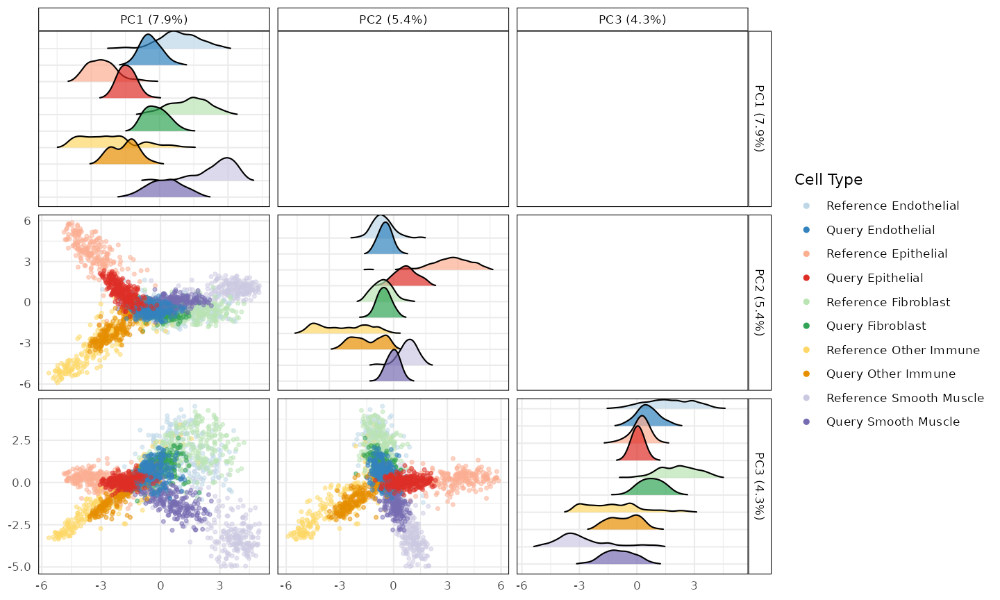
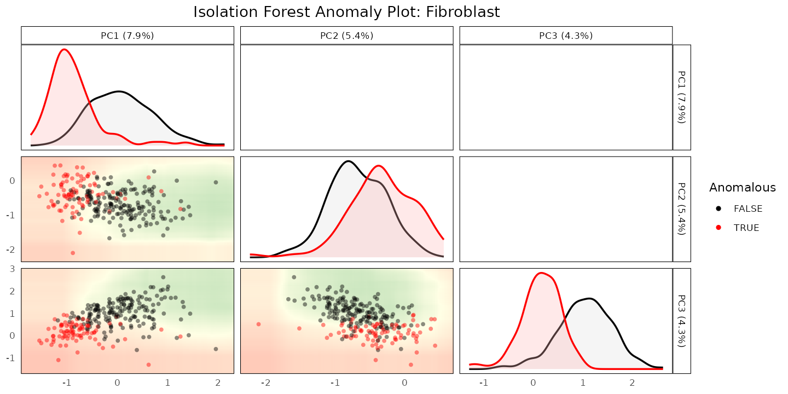
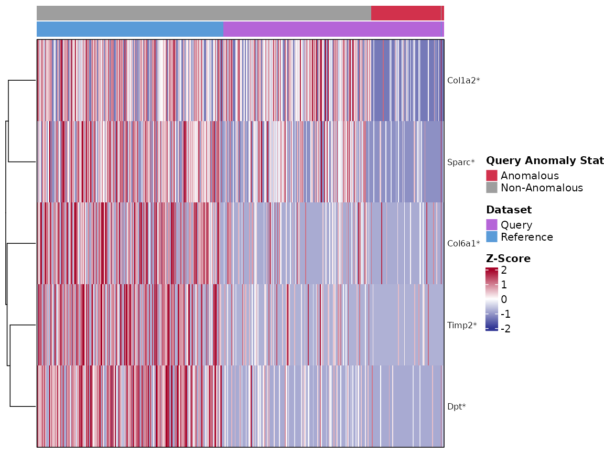
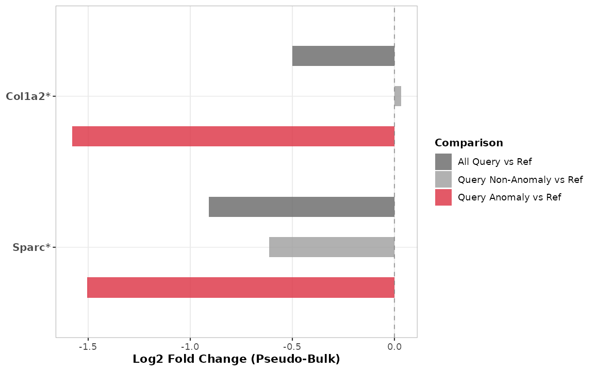

# 4. Case Study: An Inflamed Fibroblast State in Spatial Colitis Data

## Purpose

[Vignettes
2](https://ccb-hms.github.io/scDiagnostics/articles/ZeiselBenchmarking.html)
and
[3](https://ccb-hms.github.io/scDiagnostics/articles/COVIDCaseStudy.html)
worked with dissociated scRNA-seq data. `scDiagnostics` operates on
*[SingleCellExperiment](https://bioconductor.org/packages/3.23/SingleCellExperiment)*
objects and does not assume any particular assay - the same diagnostics
apply directly to a
*[SpatialExperiment](https://bioconductor.org/packages/3.23/SpatialExperiment)*
object from imaging-based spatial transcriptomics, without modification,
and the same holds for
*[SpatialFeatureExperiment](https://bioconductor.org/packages/3.23/SpatialFeatureExperiment)*
objects (which extend `SpatialExperiment` with explicit cell/tissue
geometries), since both inherit the same core `SingleCellExperiment`
interface that `scDiagnostics` relies on. This vignette repeats the
project-detect- characterize workflow on MERFISH spatial data from a
mouse model of DSS-induced colitis (Cadinu et al. 2024): healthy colon
tissue (Day 0, reference) versus tissue at peak inflammation (Day 9,
query).

``` r

library(scDiagnostics)
library(SingleCellExperiment)
library(SpatialExperiment)

set.seed(100)
```

## The data

`merfish_reference_data` and `merfish_query_data` are downsampled
subsets on the same 943-gene targeted MERFISH panel, restricted to 5
shared cell types; see
[`?merfish_reference_data`](https://ccb-hms.github.io/scDiagnostics/reference/merfish_reference_data.md)
for details. At Day 9, some fibroblasts further split into an
inflammation-associated “Inflamed Fibroblast” state (`tier2_merged`)
that does not exist at Day 0; a merged `cell_type_merged` column
collapses this back into a shared “Fibroblast” label so the two
timepoints can be compared directly.

``` r

data("merfish_reference_data")
data("merfish_query_data")

class(merfish_reference_data)
#> [1] "SpatialExperiment"
#> attr(,"package")
#> [1] "SpatialExperiment"
table(merfish_reference_data$cell_type_merged)
#> 
#>   Endothelial    Epithelial    Fibroblast  Other Immune Smooth Muscle 
#>           220           220           220           220           220
table(merfish_query_data$tier2_merged[merfish_query_data$cell_type_merged == "Fibroblast"])
#> 
#>          Fibroblast Inflamed Fibroblast 
#>                 163                  97
```

## Step 1: project

``` r

plotCellTypePCA(
    query_data = merfish_query_data,
    reference_data = merfish_reference_data,
    cell_types = unique(merfish_reference_data$cell_type_merged),
    query_cell_type_col = "cell_type_merged",
    ref_cell_type_col = "cell_type_merged",
    pc_subset = 1:3)
#> Picking joint bandwidth of 0.279
#> Picking joint bandwidth of 0.222
#> Picking joint bandwidth of 0.251
```



## Step 2: detect

``` r

anomaly_output <- detectAnomaly(
    reference_data = merfish_reference_data,
    query_data = merfish_query_data,
    ref_cell_type_col = "cell_type_merged",
    query_cell_type_col = "cell_type_merged",
    cell_types = "Fibroblast",
    pc_subset = 1:5,
    n_tree = 500)

is_anomalous <- anomaly_output[["Fibroblast"]]$query_anomaly
mean(is_anomalous)
#> [1] 0.3307692
```

``` r

plot(anomaly_output, cell_type = "Fibroblast", pc_subset = 1:3, data_type = "query")
```



Because `merfish_query_data` retains the original fine-grained
`tier2_merged` label, we can check how the flagged cells relate to the
ground-truth “Inflamed Fibroblast” state:

``` r

fibro_query <- merfish_query_data[, merfish_query_data$cell_type_merged == "Fibroblast"]
tapply(is_anomalous, fibro_query$tier2_merged, mean)
#>          Fibroblast Inflamed Fibroblast 
#>           0.1779141           0.5876289
```

In this downsampled dataset, cells with the ground-truth “Inflamed
Fibroblast” label are flagged as anomalous roughly twice as often as
plain “Fibroblast” cells - a real enrichment, though far from a clean
separation, consistent with inflammation being a graded rather than
binary state at the single-cell level.

## Step 3: characterize

To characterize what distinguishes the flagged cells,
[`calculateGeneShifts()`](https://ccb-hms.github.io/scDiagnostics/reference/calculateGeneShifts.md)
can run its own internal anomaly detection (`detect_anomalies = TRUE`,
`anomaly_comparison = TRUE`) on the full 943-gene panel - the same panel
[`detectAnomaly()`](https://ccb-hms.github.io/scDiagnostics/reference/detectAnomaly.md)
used above - while restricting the actual statistical comparison to a
small extracellular matrix (ECM) gene panel via `genes_to_analyze`. This
keeps detection and characterization consistent without needing to
manually subset cells first:

``` r

ecm_signature <- c("Col1a2", "Timp2", "Col6a1", "Sparc", "Dpt")

gene_shifts <- calculateGeneShifts(
    query_data = merfish_query_data,
    reference_data = merfish_reference_data,
    query_cell_type_col = "cell_type_merged",
    ref_cell_type_col = "cell_type_merged",
    cell_types = "Fibroblast",
    pc_subset = 1:5,
    genes_to_analyze = ecm_signature,
    detect_anomalies = TRUE,
    anomaly_comparison = TRUE)

gene_shifts$PC1[order(gene_shifts$PC1$p_adjusted), ]
#>     gene loading  cell_type      p_value mean_query mean_reference   p_adjusted
#> 1    Dpt      NA Fibroblast 5.122401e-26  0.1317246       1.991780 2.561201e-25
#> 2  Sparc      NA Fibroblast 5.230999e-23  0.2882483       1.868690 1.307750e-22
#> 3 Col1a2      NA Fibroblast 1.030939e-22  0.4023466       2.106959 1.718231e-22
#> 4  Timp2      NA Fibroblast 9.084576e-20  0.1081913       1.289465 1.135572e-19
#> 5 Col6a1      NA Fibroblast 2.190372e-18  0.1925289       1.396044 2.190372e-18
#>   significant
#> 1        TRUE
#> 2        TRUE
#> 3        TRUE
#> 4        TRUE
#> 5        TRUE
```

[`plot()`](https://rdrr.io/r/graphics/plot.default.html) shows this as a
heatmap of per-gene z-scores, one column per cell (reference and query,
annotated by anomaly status), rather than collapsing each group to a
single averaged column - which matters here, since it reveals more than
the group averages alone would:

``` r

plot(gene_shifts, cell_type = "Fibroblast", pc_subset = 1:5,
    plot_type = "heatmap", plot_by = "p_adjusted", n_genes = 5,
    show_anomalies = TRUE)
```



All five ECM genes are significantly lower in the anomalous query
fibroblasts than in the reference, but the heatmap shows this isn’t a
single uniform effect. `Col1a2` and `Sparc` show a visible extra drop
concentrated specifically in the anomalous (rightmost, red-annotated)
cells, beyond what’s already true of the query more broadly. `Timp2`,
`Col6a1`, and `Dpt`, on the other hand, are already substantially
reduced across essentially *all* query fibroblasts - anomalous or not -
so for those three genes,
[`detectAnomaly()`](https://ccb-hms.github.io/scDiagnostics/reference/detectAnomaly.md)
isn’t isolating a distinctly-shifted subgroup so much as reflecting a
shift already present dataset-wide. This split held up across several
PC-subset choices we checked, so it looks like a real property of this
dataset rather than a detection parameter to tune away: some genes
distinguish the specific cells flagged as anomalous, and others
distinguish the query condition as a whole - both are useful, but
they’re different claims.

The barplot below focuses on `Col1a2` and `Sparc` specifically, since
they’re the clearest example of the anomaly-specific pattern - a “Query
Non-Anomaly vs Ref” bar close to zero alongside a much larger “Query
Anomaly vs Ref” bar, showing the shift really is concentrated in the
flagged cells for these two genes (unlike `Timp2`/`Col6a1`/`Dpt` above,
where the non-anomaly bar would already be nearly as large as the
anomaly bar):

``` r

gene_shifts_focused <- calculateGeneShifts(
    query_data = merfish_query_data,
    reference_data = merfish_reference_data,
    query_cell_type_col = "cell_type_merged",
    ref_cell_type_col = "cell_type_merged",
    cell_types = "Fibroblast",
    pc_subset = 1:5,
    genes_to_analyze = c("Col1a2", "Sparc"),
    detect_anomalies = TRUE,
    anomaly_comparison = TRUE)

plot(gene_shifts_focused, cell_type = "Fibroblast", pc_subset = 1:5,
    plot_type = "barplot", plot_by = "p_adjusted", n_genes = 2,
    show_anomalies = TRUE, pseudo_bulk = TRUE)
```



As with the COVID-19 case study, this is a specific finding about this
cell population in this dataset; the broader claim that this workflow
generalizes across data modalities is best supported by comparing this
result to the scRNA-seq case study in vignette 3, not by either result
alone.

------------------------------------------------------------------------

## R Session Info

    R version 4.6.1 (2026-06-24)
    Platform: x86_64-pc-linux-gnu
    Running under: Ubuntu 24.04.5 LTS

    Matrix products: default
    BLAS:   /usr/lib/x86_64-linux-gnu/openblas-pthread/libblas.so.3 
    LAPACK: /usr/lib/x86_64-linux-gnu/openblas-pthread/libopenblasp-r0.3.26.so;  LAPACK version 3.12.0

    locale:
     [1] LC_CTYPE=C.UTF-8       LC_NUMERIC=C           LC_TIME=C.UTF-8       
     [4] LC_COLLATE=C.UTF-8     LC_MONETARY=C.UTF-8    LC_MESSAGES=C.UTF-8   
     [7] LC_PAPER=C.UTF-8       LC_NAME=C              LC_ADDRESS=C          
    [10] LC_TELEPHONE=C         LC_MEASUREMENT=C.UTF-8 LC_IDENTIFICATION=C   

    time zone: UTC
    tzcode source: system (glibc)

    attached base packages:
    [1] stats4    stats     graphics  grDevices utils     datasets  methods  
    [8] base     

    other attached packages:
     [1] SpatialExperiment_1.22.0    SingleCellExperiment_1.34.0
     [3] SummarizedExperiment_1.42.0 Biobase_2.72.0             
     [5] GenomicRanges_1.64.0        Seqinfo_1.2.0              
     [7] IRanges_2.46.0              S4Vectors_0.50.3           
     [9] BiocGenerics_0.58.1         generics_0.1.4             
    [11] MatrixGenerics_1.24.0       matrixStats_1.5.0          
    [13] scDiagnostics_1.7.11        BiocStyle_2.40.0           

    loaded via a namespace (and not attached):
     [1] tidyselect_1.2.1      dplyr_1.2.1           farver_2.1.2         
     [4] S7_0.2.2              fastmap_1.2.0         GGally_2.4.0         
     [7] digest_0.6.39         lifecycle_1.0.5       cluster_2.1.8.2      
    [10] magrittr_2.0.5        compiler_4.6.1        rlang_1.3.0          
    [13] sass_0.4.10           tools_4.6.1           yaml_2.3.12          
    [16] knitr_1.52            S4Arrays_1.12.0       labeling_0.4.3       
    [19] htmlwidgets_1.6.4     DelayedArray_0.38.2   RColorBrewer_1.1-3   
    [22] abind_1.4-8           withr_3.0.3           purrr_1.2.2          
    [25] desc_1.4.3            grid_4.6.1            colorspace_2.1-3     
    [28] ggplot2_4.0.3         scales_1.4.0          iterators_1.0.14     
    [31] ggridges_0.5.7        cli_3.6.6             rmarkdown_2.32       
    [34] crayon_1.5.3          ragg_1.5.2            otel_0.2.0           
    [37] rjson_0.2.23          cachem_1.1.0          parallel_4.6.1       
    [40] BiocManager_1.30.27   XVector_0.52.0        vctrs_0.7.3          
    [43] Matrix_1.7-5          jsonlite_2.0.0        bookdown_0.48        
    [46] GetoptLong_1.1.1      clue_0.3-68           systemfonts_1.3.2    
    [49] magick_2.9.1          foreach_1.5.2         jquerylib_0.1.4      
    [52] tidyr_1.3.2           glue_1.8.1            pkgdown_2.2.1        
    [55] ggstats_0.14.0        codetools_0.2-20      shape_1.4.6.1        
    [58] gtable_0.3.6          ComplexHeatmap_2.28.0 tibble_3.3.1         
    [61] pillar_1.11.1         htmltools_0.5.9       circlize_0.4.18      
    [64] R6_2.6.1              textshaping_1.0.5     doParallel_1.0.17    
    [67] evaluate_1.0.5        isotree_0.6.1-5       lattice_0.22-9       
    [70] png_0.1-9             RhpcBLASctl_0.23-42   bslib_0.12.0         
    [73] Rcpp_1.1.2            SparseArray_1.12.2    xfun_0.61            
    [76] GlobalOptions_0.1.4   fs_2.1.0              pkgconfig_2.0.3      
