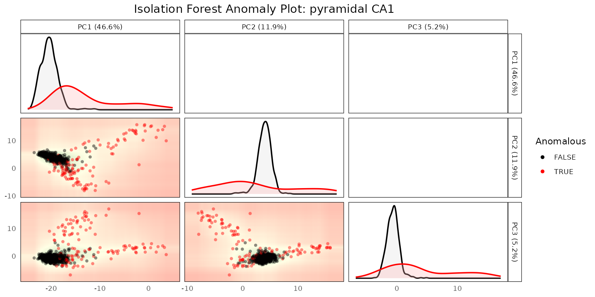
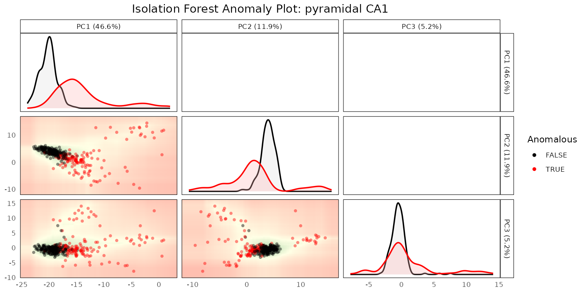
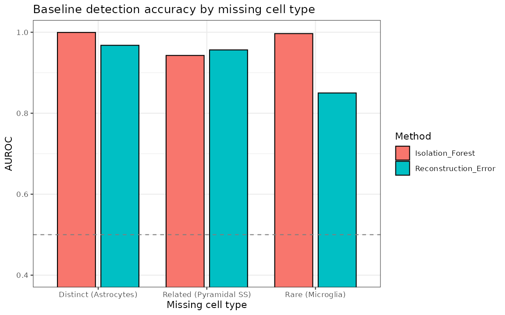
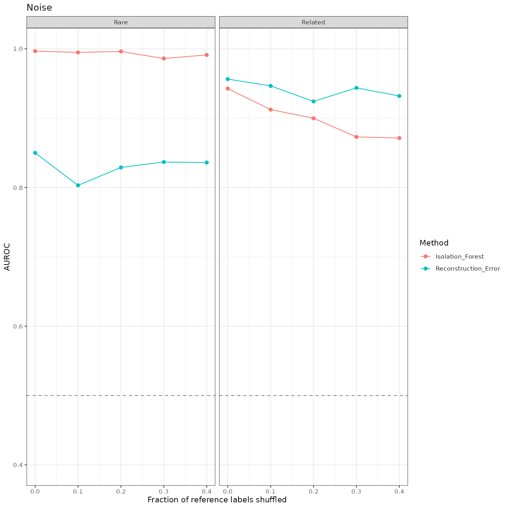
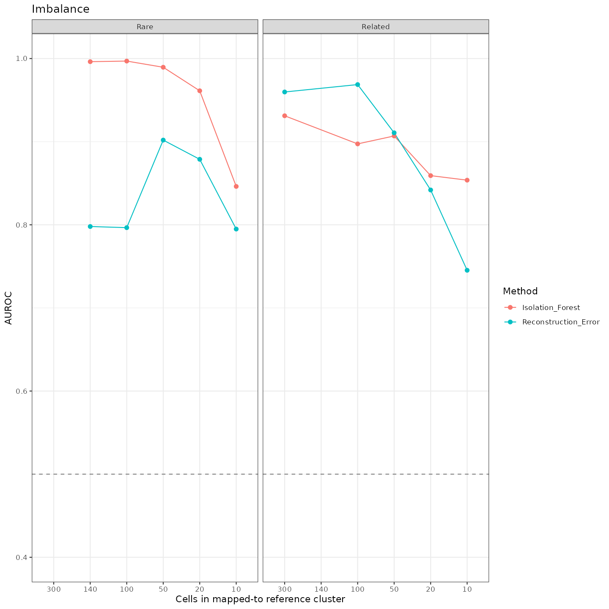
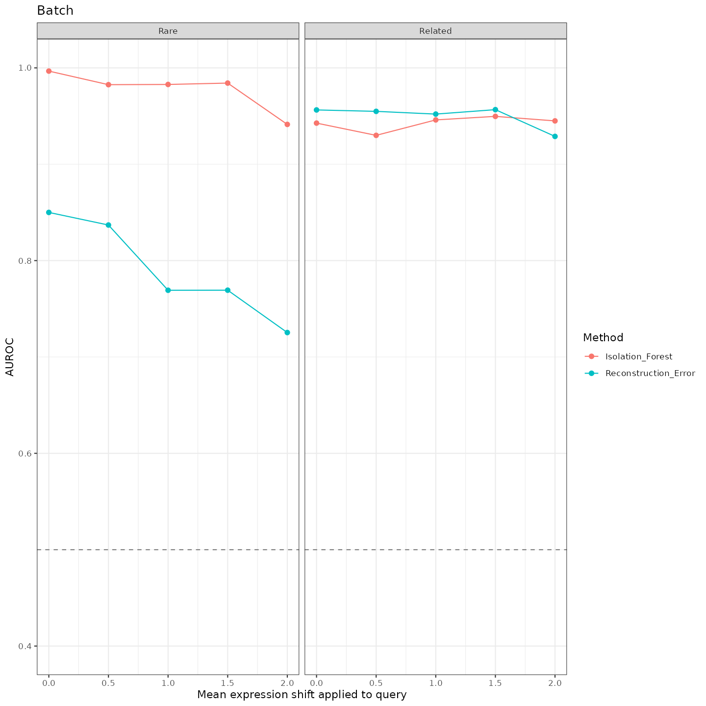
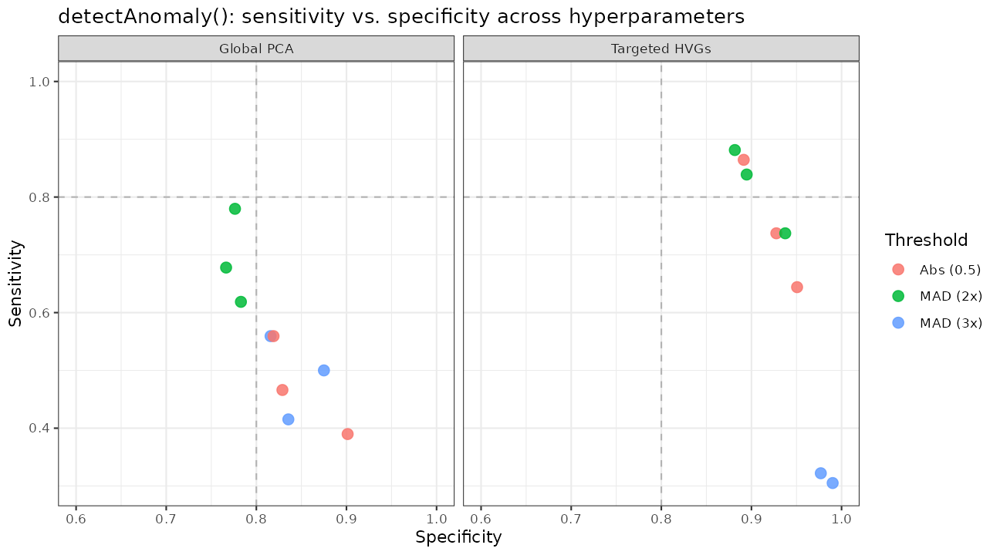
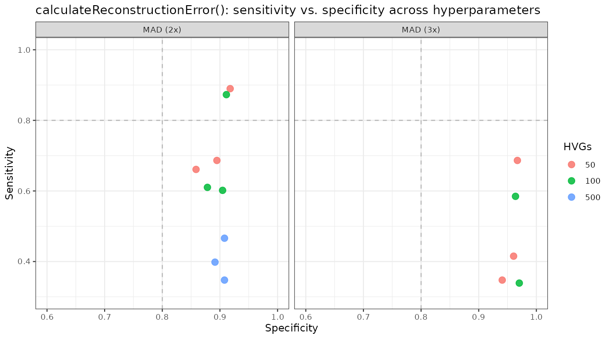

# 2. Benchmarking Anomaly Detection Against Ground Truth

## Purpose

[Vignette
1](https://ccb-hms.github.io/scDiagnostics/articles/Introduction.html)
showed
[`detectAnomaly()`](https://ccb-hms.github.io/scDiagnostics/reference/detectAnomaly.md)
correctly flagging a subset of misannotated cells in one simulated
example. A single example only goes so far: how well does this actually
work in general, and how sensitive is it to the choices you have to
make - which cell type is missing, how much label noise is in the
reference, how imbalanced the cell types are, or how large a batch
effect separates query from reference?

This vignette works through those questions on the Zeisel mouse brain
dataset (*[scRNAseq](https://bioconductor.org/packages/3.23/scRNAseq)*),
comparing
[`detectAnomaly()`](https://ccb-hms.github.io/scDiagnostics/reference/detectAnomaly.md)
(Isolation Forest) against
[`calculateReconstructionError()`](https://ccb-hms.github.io/scDiagnostics/reference/calculateReconstructionError.md)
(PCA reconstruction error), the package’s two cell-type-specific anomaly
detection methods.

``` r

library(scDiagnostics)
library(SingleCellExperiment)
library(SingleR)
library(ggplot2)
library(dplyr)
```

## A live example: a withheld cell type related to a retained one

`zeisel_reference_data` and `zeisel_query_data` are a 70/30 split of the
Zeisel dataset (log-normalized, top 250 HVGs, PCA precomputed); see
[`?zeisel_reference_data`](https://ccb-hms.github.io/scDiagnostics/reference/zeisel_reference_data.md)
for details.

``` r

data("zeisel_reference_data")
data("zeisel_query_data")

table(zeisel_reference_data$true_cell_type)
#> 
#> astrocytes_ependymal    endothelial-mural         interneurons 
#>                  143                  158                  196 
#>            microglia     oligodendrocytes        pyramidal CA1 
#>                   68                  572                  685 
#>         pyramidal SS 
#>                  281
```

We withhold “pyramidal SS” from the reference entirely - a harder
detection problem than withholding a rare-but-distinct type, since
pyramidal SS is transcriptionally similar to the retained “pyramidal
CA1” type. We use `SingleR` to see where the query’s true pyramidal SS
cells end up being mapped:

``` r

set.seed(1)
reference_missing <- zeisel_reference_data[, zeisel_reference_data$true_cell_type != "pyramidal SS"]
reference_missing <- scater::runPCA(reference_missing, ncomponents = 10)

pred <- SingleR(test = zeisel_query_data, ref = reference_missing,
                labels = reference_missing$true_cell_type)
zeisel_query_data$SingleR_annotation <- pred$labels

table(zeisel_query_data$SingleR_annotation[zeisel_query_data$true_cell_type == "pyramidal SS"])
#> 
#> astrocytes_ependymal         interneurons     oligodendrocytes 
#>                    1                    1                   10 
#>        pyramidal CA1 
#>                  106
```

Nearly all the true pyramidal SS cells get mapped to “pyramidal CA1”.
Since we know which query cells are truly pyramidal SS, we can check how
well
[`detectAnomaly()`](https://ccb-hms.github.io/scDiagnostics/reference/detectAnomaly.md)
and
[`calculateReconstructionError()`](https://ccb-hms.github.io/scDiagnostics/reference/calculateReconstructionError.md)
separate them from the correctly-labeled pyramidal CA1 cells they were
mapped alongside:

``` r

target <- "pyramidal CA1"

anomaly_output <- detectAnomaly(
    reference_data = reference_missing, query_data = zeisel_query_data,
    ref_cell_type_col = "true_cell_type", query_cell_type_col = "SingleR_annotation",
    cell_types = target, n_hvgs = 30, pc_subset = 1:8, n_tree = 500)

reconstruction_output <- calculateReconstructionError(
    reference_data = reference_missing, query_data = zeisel_query_data,
    ref_cell_type_col = "true_cell_type", query_cell_type_col = "SingleR_annotation",
    cell_types = target, n_hvgs = 30, pc_subset = 1:8)
#> Warning in fitTrendVar(fm, fv, ...): 'fitTrendVar' is deprecated.
#> Use 'scrapper::fitVarianceTrend' instead.
#> See help("Deprecated")
#> Warning in combineBlocks(collected, method = method, equiweight = equiweight, : 'combineBlocks' is deprecated.
#> See help("Deprecated")
#> Warning in scran::getTopHVGs(var_stats, n = n_hvgs_actual): 'scran::getTopHVGs' is deprecated.
#> Use 'scrapper::chooseHighlyVariableGenes' instead.
#> See help("Deprecated")
#> Warning in fitTrendVar(fm, fv, ...): 'fitTrendVar' is deprecated.
#> Use 'scrapper::fitVarianceTrend' instead.
#> See help("Deprecated")
#> Warning in combineBlocks(collected, method = method, equiweight = equiweight, : 'combineBlocks' is deprecated.
#> See help("Deprecated")
#> Warning in scran::getTopHVGs(var_stats, n = n_hvgs_actual): 'scran::getTopHVGs' is deprecated.
#> Use 'scrapper::chooseHighlyVariableGenes' instead.
#> See help("Deprecated")

labels_target <- zeisel_query_data$true_cell_type[zeisel_query_data$SingleR_annotation == target]

data.frame(
    Method = c("detectAnomaly (Isolation Forest)", "calculateReconstructionError"),
    `True pyramidal SS flagged` = c(
        mean(anomaly_output[[target]]$query_anomaly[labels_target == "pyramidal SS"]),
        mean(reconstruction_output[[target]]$query_anomaly[labels_target == "pyramidal SS"])),
    `True pyramidal CA1 flagged` = c(
        mean(anomaly_output[[target]]$query_anomaly[labels_target == target]),
        mean(reconstruction_output[[target]]$query_anomaly[labels_target == target])),
    check.names = FALSE)
#>                             Method True pyramidal SS flagged
#> 1 detectAnomaly (Isolation Forest)                 0.8113208
#> 2     calculateReconstructionError                 0.8962264
#>   True pyramidal CA1 flagged
#> 1                  0.2292490
#> 2                  0.1264822
```

In this run, both methods flag most of the true pyramidal SS cells while
flagging a smaller fraction of the correctly-labeled pyramidal CA1
cells - neither is perfect, which is exactly the situation where
combining them (see below) is worth considering. We can visualize the
Isolation Forest result; `data_type` shows one dataset per plot, so we
look at the reference (defining what “normal” looks like) and the query
(colored by anomaly status) side by side:

``` r

plot(anomaly_output, cell_type = target, data_type = "reference", pc_subset = 1:3)
```



``` r

plot(anomaly_output, cell_type = target, data_type = "query", pc_subset = 1:3)
```



This is one scenario (one withheld cell type, one reference/query split,
default settings beyond `n_hvgs`/`pc_subset`). The rest of this vignette
summarizes a systematic evaluation across many such scenarios, computed
once offline on the full (non-downsampled) Zeisel dataset; see
[`?zeisel_benchmark_results`](https://ccb-hms.github.io/scDiagnostics/reference/zeisel_benchmark_results.md)
and `inst/script/ZeiselBenchmarkResults.R` for the exact procedure.

``` r

data("zeisel_benchmark_results")
names(zeisel_benchmark_results)
#> [1] "gradients" "if_tuning" "re_tuning"
```

## Baseline: distinct, related, and rare withheld cell types

Withholding a cell type that is transcriptionally distinct from
everything else (astrocytes) is an easier detection problem than
withholding one that closely resembles a retained cell type (pyramidal
SS, which is related to the retained pyramidal CA1), or one that is
simply rare (microglia):

``` r

baseline <- zeisel_benchmark_results$gradients %>%
    filter(TestGroup == "Baseline") %>%
    mutate(Test = factor(Test, levels = c("Distinct (Astrocytes)",
                                          "Related (Pyramidal SS)",
                                          "Rare (Microglia)")))

ggplot(baseline, aes(x = Test, y = AUROC, fill = Method)) +
    geom_col(position = position_dodge(width = 0.8), width = 0.7, color = "black") +
    geom_hline(yintercept = 0.5, linetype = "dashed", color = "gray50") +
    coord_cartesian(ylim = c(0.4, 1)) +
    labs(x = "Missing cell type", y = "AUROC",
        title = "Baseline detection accuracy by missing cell type") +
    theme_bw()
```



Across these three scenarios, both methods reach a high AUROC, with
Isolation Forest at or above 0.94 in all three and Reconstruction Error
weakest on the rare (microglia) scenario in this particular run.

## Sensitivity to label noise, class imbalance, and batch effects

For the “related” (pyramidal SS) and “rare” (microglia) scenarios, the
benchmark also varies three conditions independently: the fraction of
reference labels randomly shuffled (label noise), the number of cells
retained in the mapped-to reference cluster (class imbalance), and a
mean expression shift applied to 20% of query genes (a stand-in for a
batch effect).

``` r

gradients <- zeisel_benchmark_results$gradients %>%
    filter(TestGroup %in% c("Related", "Rare"))

plot_gradient <- function(df, test_name, x_lab, decreasing_x = FALSE) {
    sub_df <- df %>% filter(Test == test_name)
    sub_df$X_Value <- if (decreasing_x) {
        factor(sub_df$X_Value, levels = sort(as.numeric(unique(sub_df$X_Value)), decreasing = TRUE))
    } else {
        as.numeric(sub_df$X_Value)
    }
    ggplot(sub_df, aes(x = X_Value, y = AUROC, color = Method, group = Method)) +
        geom_line() + geom_point(size = 2) +
        geom_hline(yintercept = 0.5, linetype = "dashed", color = "gray50") +
        coord_cartesian(ylim = c(0.4, 1)) +
        facet_wrap(~TestGroup) +
        labs(x = x_lab, y = "AUROC", title = test_name) +
        theme_bw()
}

noise_plot <- plot_gradient(gradients, "Noise", "Fraction of reference labels shuffled")
imbalance_plot <- plot_gradient(gradients, "Imbalance", "Cells in mapped-to reference cluster", decreasing_x = TRUE)
batch_plot <- plot_gradient(gradients, "Batch", "Mean expression shift applied to query")

noise_plot
```



``` r

imbalance_plot
```



``` r

batch_plot
```



In this benchmark, both methods stay well above the AUROC = 0.5 no-skill
baseline across the full range of label noise and class imbalance
tested. Under an increasing batch effect, Isolation Forest tends to hold
up better than Reconstruction Error in the rare (microglia) scenario -
consistent with the idea that a tree-based method partitioning on
individual PCs can be more robust to a systematic shift than a global
reconstruction-error metric, though this is a pattern observed in this
specific benchmark rather than a general guarantee.

## Hyperparameter sensitivity

Both methods require choices: how many HVGs or PCs to use, and what
threshold marks a cell as anomalous. The benchmark also grid-searches
these choices for a single scenario (pyramidal SS withheld, mapped to
pyramidal CA1):

Each point is one hyperparameter configuration (a choice of PCs or HVGs,
and a threshold rule); splitting the grid into one panel per feature
space (for
[`detectAnomaly()`](https://ccb-hms.github.io/scDiagnostics/reference/detectAnomaly.md))
or per MAD threshold (for
[`calculateReconstructionError()`](https://ccb-hms.github.io/scDiagnostics/reference/calculateReconstructionError.md))
keeps each panel to a handful of points:

``` r

ggplot(zeisel_benchmark_results$if_tuning,
      aes(x = Specificity, y = Sensitivity, color = Threshold)) +
    geom_hline(yintercept = 0.8, linetype = "dashed", color = "gray70") +
    geom_vline(xintercept = 0.8, linetype = "dashed", color = "gray70") +
    geom_point(size = 3, alpha = 0.85) +
    facet_wrap(~Mode) +
    coord_cartesian(xlim = c(0.6, 1), ylim = c(0.3, 1)) +
    labs(title = "detectAnomaly(): sensitivity vs. specificity across hyperparameters") +
    theme_bw()
```



``` r

ggplot(zeisel_benchmark_results$re_tuning,
      aes(x = Specificity, y = Sensitivity, color = HVGs)) +
    geom_hline(yintercept = 0.8, linetype = "dashed", color = "gray70") +
    geom_vline(xintercept = 0.8, linetype = "dashed", color = "gray70") +
    geom_point(size = 3, alpha = 0.85) +
    facet_wrap(~MAD_Threshold) +
    coord_cartesian(xlim = c(0.6, 1), ylim = c(0.3, 1)) +
    labs(title = "calculateReconstructionError(): sensitivity vs. specificity across hyperparameters") +
    theme_bw()
```



(The dashed lines mark 80% sensitivity/specificity as a rough visual
reference, not a formal threshold.) Within each panel, points still vary
by PC subset or HVG count - the full per-configuration breakdown is in
`zeisel_benchmark_results$if_tuning`/`re_tuning` if you want to identify
a specific one.

In this grid, no single configuration dominates on both sensitivity and
specificity simultaneously (the usual precision/recall trade-off). For
this particular scenario, configurations using a small,
cell-type-targeted set of HVGs with a MAD-based threshold tend to land
closer to the top-right (high sensitivity and specificity) corner - but
that is a property of *this* benchmark, not a universal ranking of
hyperparameters, and a different dataset could favor a different
configuration. `n_hvgs = 30` with a MAD-based threshold (the defaults
used earlier in this vignette) is a reasonable starting point rather
than a claim that it is optimal in general; it’s worth re-checking
against your own data if detection accuracy matters a lot for your use
case.

## Combining both methods

[`detectAnomaly()`](https://ccb-hms.github.io/scDiagnostics/reference/detectAnomaly.md)
and
[`calculateReconstructionError()`](https://ccb-hms.github.io/scDiagnostics/reference/calculateReconstructionError.md)
look at different parts of the data and can fail in different ways,
which makes them candidates for use together rather than as competitors:

- [`detectAnomaly()`](https://ccb-hms.github.io/scDiagnostics/reference/detectAnomaly.md)
  partitions cells directly along the retained principal components - it
  flags cells that sit in an unusual location *within* that
  low-dimensional PC subspace.
- [`calculateReconstructionError()`](https://ccb-hms.github.io/scDiagnostics/reference/calculateReconstructionError.md)
  does the opposite in a sense: it compresses each cell to that same
  low-dimensional subspace and back, and flags cells whose original
  expression profile isn’t well reconstructed - i.e. it is sensitive to
  signal in the subspace *orthogonal* to the retained PCs (loosely, the
  null space of the PCA projection), which Isolation Forest never looks
  at directly.

Because they emphasize different subspaces, flagging a cell as anomalous
whenever *either* method flags it (the union of the two) can catch cells
that one method misses but the other doesn’t - raising sensitivity
beyond what either method achieves alone, at the cost of more false
positives. In the pyramidal SS example above, neither method alone is
perfect, and their errors don’t fully overlap:

``` r

if_flag <- anomaly_output[[target]]$query_anomaly
re_flag <- reconstruction_output[[target]]$query_anomaly
union_flag <- if_flag | re_flag

data.frame(
    Rule = c("Isolation Forest only", "Reconstruction Error only",
            "Either flags (union)"),
    `True pyramidal SS flagged` = c(
        mean(if_flag[labels_target == "pyramidal SS"]),
        mean(re_flag[labels_target == "pyramidal SS"]),
        mean(union_flag[labels_target == "pyramidal SS"])),
    `True pyramidal CA1 flagged` = c(
        mean(if_flag[labels_target == target]),
        mean(re_flag[labels_target == target]),
        mean(union_flag[labels_target == target])),
    check.names = FALSE)
#>                        Rule True pyramidal SS flagged
#> 1     Isolation Forest only                 0.8113208
#> 2 Reconstruction Error only                 0.8962264
#> 3      Either flags (union)                 0.9528302
#>   True pyramidal CA1 flagged
#> 1                  0.2292490
#> 2                  0.1264822
#> 3                  0.2964427
```

In this run, the union flags more true pyramidal SS cells than either
method alone - each method catches some cells the other misses. That
gain isn’t free: the union also flags more of the correctly-labeled
pyramidal CA1 cells than either method alone, since it inherits every
false positive from both. Whether that trade-off is worth it (versus
requiring both methods to agree, which pushes the other way - fewer
false positives, but only the anomalies both methods happen to catch)
depends on whether missing a real anomaly or chasing a false one is more
costly for your analysis. Neither combination rule is “correct” in
general, and this result is specific to this scenario, not a claim that
the union always beats each method individually.

------------------------------------------------------------------------

## R Session Info

    R version 4.6.1 (2026-06-24)
    Platform: x86_64-pc-linux-gnu
    Running under: Ubuntu 24.04.5 LTS

    Matrix products: default
    BLAS:   /usr/lib/x86_64-linux-gnu/openblas-pthread/libblas.so.3 
    LAPACK: /usr/lib/x86_64-linux-gnu/openblas-pthread/libopenblasp-r0.3.26.so;  LAPACK version 3.12.0

    locale:
     [1] LC_CTYPE=C.UTF-8       LC_NUMERIC=C           LC_TIME=C.UTF-8       
     [4] LC_COLLATE=C.UTF-8     LC_MONETARY=C.UTF-8    LC_MESSAGES=C.UTF-8   
     [7] LC_PAPER=C.UTF-8       LC_NAME=C              LC_ADDRESS=C          
    [10] LC_TELEPHONE=C         LC_MEASUREMENT=C.UTF-8 LC_IDENTIFICATION=C   

    time zone: UTC
    tzcode source: system (glibc)

    attached base packages:
    [1] stats4    stats     graphics  grDevices utils     datasets  methods  
    [8] base     

    other attached packages:
     [1] dplyr_1.2.1                 ggplot2_4.0.3              
     [3] SingleR_2.14.2              SingleCellExperiment_1.34.0
     [5] SummarizedExperiment_1.42.0 Biobase_2.72.0             
     [7] GenomicRanges_1.64.0        Seqinfo_1.2.0              
     [9] IRanges_2.46.0              S4Vectors_0.50.3           
    [11] BiocGenerics_0.58.1         generics_0.1.4             
    [13] MatrixGenerics_1.24.0       matrixStats_1.5.0          
    [15] scDiagnostics_1.7.14        BiocStyle_2.40.0           

    loaded via a namespace (and not attached):
     [1] gridExtra_2.3.1     rlang_1.3.0         magrittr_2.0.5     
     [4] scater_1.40.2       otel_0.2.0          ggridges_0.5.7     
     [7] compiler_4.6.1      systemfonts_1.3.2   vctrs_0.7.3        
    [10] pkgconfig_2.0.3     fastmap_1.2.0       XVector_0.52.0     
    [13] scuttle_1.22.0      labeling_0.4.3      rmarkdown_2.32     
    [16] ggbeeswarm_0.7.3    ragg_1.5.2          purrr_1.2.2        
    [19] xfun_0.61           bluster_1.22.0      cachem_1.1.0       
    [22] beachmat_2.28.0     jsonlite_2.0.0      DelayedArray_0.38.2
    [25] BiocParallel_1.46.0 irlba_2.3.7         parallel_4.6.1     
    [28] cluster_2.1.8.2     R6_2.6.1            bslib_0.12.0       
    [31] RColorBrewer_1.1-3  limma_3.68.5        GGally_2.4.0       
    [34] jquerylib_0.1.4     Rcpp_1.1.2          bookdown_0.48      
    [37] knitr_1.52          Matrix_1.7-5        igraph_2.3.3       
    [40] tidyselect_1.2.1    abind_1.4-8         yaml_2.3.12        
    [43] viridis_0.6.5       codetools_0.2-20    lattice_0.22-9     
    [46] tibble_3.3.1        withr_3.0.3         S7_0.2.2           
    [49] evaluate_1.0.5      desc_1.4.3          ggstats_0.14.0     
    [52] pillar_1.11.1       BiocManager_1.30.27 scales_1.4.0       
    [55] RhpcBLASctl_0.23-42 glue_1.8.1          metapod_1.20.0     
    [58] tools_4.6.1         BiocNeighbors_2.6.0 ScaledMatrix_1.20.0
    [61] locfit_1.5-9.12     fs_2.1.0            scran_1.40.0       
    [64] grid_4.6.1          tidyr_1.3.2         edgeR_4.10.5       
    [67] beeswarm_0.4.0      BiocSingular_1.28.0 vipor_0.4.7        
    [70] cli_3.6.6           rsvd_1.0.5          textshaping_1.0.5  
    [73] S4Arrays_1.12.0     viridisLite_0.4.3   gtable_0.3.6       
    [76] isotree_0.6.1-5     sass_0.4.10         digest_0.6.39      
    [79] SparseArray_1.12.2  ggrepel_0.9.8       dqrng_0.4.1        
    [82] htmlwidgets_1.6.4   farver_2.1.2        htmltools_0.5.9    
    [85] pkgdown_2.2.1       lifecycle_1.0.5     statmod_1.5.2      
