<h1> Getting started </h1>

# Installation

<h4> Install a Bioconductor Package </h4>

To install a package from Bioconductor use a following command:


```r
BiocManager::install("ccb-hms/scDiagnostics")
```

NOTE: you will need the remotes package to install from github.

To build the package vignettes upon installation use:


```r
BiocManager::install("ccb-hms/scDiagnostics",
                     build_vignettes = TRUE,
                     dependencies = TRUE)
```

# Prerequisites

R version tested: 4.2.3 (2023-03-15) 

To use the scDiagnostics package, you need the following R packages installed:

 * SingleCellExperiment
 * scRNAseq
 * scater
 * scran
 * ggplot2
 * AUCell
 * SingleR
 * Matrix
 * corrplot
 * RColorBrewer

 
# Usage

To explore the capabilities of the scDiagnostics package, you can load your own data or utilize publicly available datasets obtained from the scRNAseq R package. In this guide, we will demonstrate how to use scDiagnostics with such datasets, which serve as valuable resources for exploring the package and assessing the appropriateness of cell type assignments.


```r
## Loading libraries
library(scDiagnostics)
library(scater)
library(scran)
library(scRNAseq)
library(RColorBrewer)
library(SingleR)
library(AUCell)
#> Error in library(AUCell): there is no package called 'AUCell'
library(corrplot)
#> Error in library(corrplot): there is no package called 'corrplot'
```

## Scatter Plot: QC stats vs. Annotation Scores

Here, we will consider the Human Primary Cell Atlas (Mabbott et al. 2013) as a reference dataset and our query dataset consists of Haematopoietic stem and progenitor cells from (Bunis DG et al. 2021).

In scRNA-seq studies, assessing the quality of cells is important for accurate downstream analyses. At the same time, assigning accurate cell type labels based on gene expression profiles is an integral aspect of scRNA-seq data interpretation. Generally, these two are performed independently of each other. The rationale behind this function is to inspect whether certain QC (Quality Control) criteria impact the confidence level of cell type annotations. 

For instance, it is reasonable to hypothesize that higher library sizes could contribute to increased annotation confidence due to enhanced statistical power for identifying cell type-specific gene expression patterns, as evident in the scatter plot below.


```r

# load reference dataset
ref_data <- HumanPrimaryCellAtlasData()

# Load query dataset (Bunis haematopoietic stem and progenitor cell data) from 
# Bunis DG et al. (2021). Single-Cell Mapping of Progressive Fetal-to-Adult 
# Transition in Human Naive T Cells Cell Rep. 34(1): 108573
query_data <- BunisHSPCData()
rownames(query_data) <- rowData(query_data)$Symbol

# Add QC metrics to query data
query_data <- addPerCellQCMetrics(query_data)

# Log transform query dataset
query_data <- logNormCounts(query_data)

# Run SingleR to predict cell types
pred <- SingleR(query_data, ref_data, labels = ref_data$label.main)

# Assign predicted labels to query data
colData(query_data)$pred.labels <- pred$labels

# Get annotation scores
scores <- apply(pred$scores, 1, max)

# Assign scores to query data
colData(query_data)$cell_scores <- scores

# Create a scatter plot between library size and annotation scores
p1 <- plotQCvsAnnotation(
    query_data = query_data,
    qc_col = "total",
    label_col = "pred.labels",
    score_col = "cell_scores",
    label = NULL
)
p1 + xlab("Library Size")
```

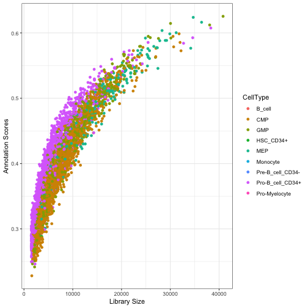

However, certain QC metrics, such as the proportion of mitochondrial genes, may require careful consideration as they can sometimes be associated with cellular states or functions rather than noise. The interpretation of mitochondrial content should be context-specific and informed by biological knowledge.

In next analysis, we investigated the relationship between mitochondrial percentage and cell type annotation scores using liver tissue data from He S et al. 2020. Notably, we observed high annotation scores for macrophages and monocytes. These findings align with the established biological characteristic of high mitochondrial activity in macrophages and monocytes, adding biological context to our results.


```r
# load query dataset
query_data <- HeOrganAtlasData(
    tissue = c("Liver"),
    ensembl = FALSE,
    location = TRUE
)

# Add QC metrics to query data
mito_genes <- rownames(query_data)[grep("^MT-", rownames(query_data))]
query_data <- unfiltered <- addPerCellQC(query_data,subsets = list(mt = mito_genes))
qc <- quickPerCellQC(colData(query_data),sub.fields="subsets_mt_percent")
query_data <- query_data[,!qc$discard]

# Log transform query dataset
query_data <- logNormCounts(query_data)

# Run SingleR to predict cell types
pred <- SingleR(query_data, ref_data, labels = ref_data$label.main)

# Assign predicted labels to query data
colData(query_data)$pred.labels <- pred$labels

# Get annotation scores
scores <- apply(pred$scores, 1, max)

# Assign scores to query data
colData(query_data)$cell_scores <- scores

# Create a new column for the labels so it is easy to distinguish between Macrophoges, Monocytes and other cells
query_data$label_category <- ifelse(query_data$pred.labels %in% c("Macrophage", "Monocyte"),
                                     query_data$pred.labels,
                                     "Other cells")


# Define custom colors for cell type labels
cols <- c("Other cells" = "grey", "Macrophage" = "green", "Monocyte" = "red")

# Generate scatter plot for all cell types
p1 <- plotQCvsAnnotation(
    query_data = query_data,
    qc_col = "subsets_mt_percent",
    label_col = "label_category",
    score_col = "cell_scores",
    label = NULL) + 
    scale_color_manual(values = cols) +
    xlab("subsets_mt_percent")
p1
```

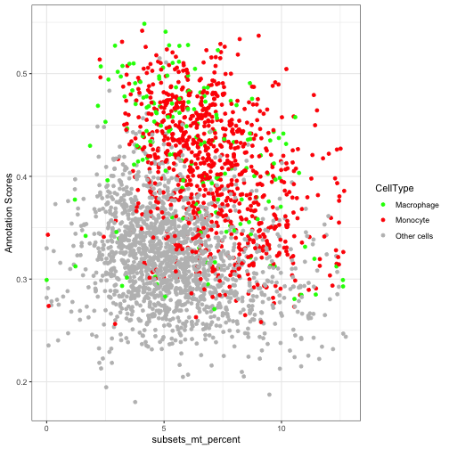

## Examining Distribution of QC stats and Annotation Scores

In addition to the scatter plot, we can gain further insights into the gene expression profiles by visualizing the distribution of user defined QC stats and annotation scores for all the cell types or specific cell types. This allows us to examine the variation and patterns in expression levels and scores across cells assigned to the cell type of interest.

To accomplish this, we create two separate histograms. The first histogram displays the distribution of the annotation scores. 

The second histogram visualizes the distribution of QC stats. This provides insights into the overall gene expression levels for the specific cell type. Here in this particular example we are investigating percentage of mitochondrial genes.

By examining the histograms, we can observe the range, shape, and potential outliers in the distribution of both annotation scores and QC stats. This allows us to assess the appropriateness of the cell type assignments and identify any potential discrepancies or patterns in the gene expression profiles for the specific cell type.


```r
# Generate histogram
histQCvsAnnotation(query_data = query_data, qc_col = "subsets_mt_percent", 
                   label_col = "pred.labels", 
                   score_col = "cell_scores", 
                   label = NULL)
```

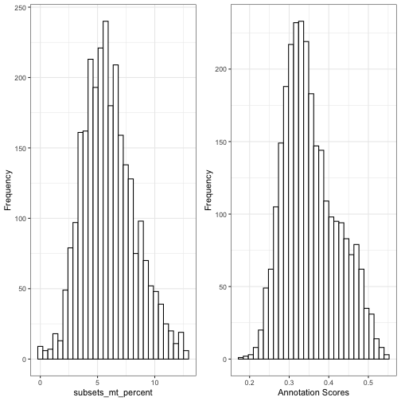

The right-skewed distribution for mitochondrial percentages and a left-skewed distribution for annotation scores in above histograms suggest that most cells have lower mitochondrial contamination and higher confidence in their assigned cell types. 

## Exploring Gene Expression Distribution

This function helps user to explore the distribution of gene expression values for a specific gene of interest across all the cells in both reference and query datasets and within specific cell types. This helps to evaluate whether the distributions are similar or aligned between the datasets. Discrepancies in distribution patterns may indicate potential incompatibilities or differences between the datasets. 

The function also allows users to narrow down their analysis to specific cell types of interest. This enables investigation of whether alignment between the query and reference datasets is consistent not only at a global level but also within specific cell types.


```r

# Load data
sce <- HeOrganAtlasData(tissue = c("Marrow"), ensembl = FALSE)

# Divide the data into reference and query datasets
set.seed(100)
indices <- sample(ncol(assay(sce)), size = floor(0.7 * ncol(assay(sce))), replace = FALSE)
ref_data <- sce[, indices]
query_data <- sce[, -indices]

# Log-transform datasets
ref_data <- logNormCounts(ref_data)
query_data <- logNormCounts(query_data)

# Run PCA
ref_data <- runPCA(ref_data)
query_data <- runPCA(query_data)

# Get cell type scores using SingleR
pred <- SingleR(query_data, ref_data, labels = ref_data$reclustered.broad)
pred <- as.data.frame(pred)
   
# Assign labels to query data
colData(query_data)$labels <- pred$labels
   
# Generate density plots
plotMarkerExpression(reference_data = ref_data, 
                     query_data = query_data, 
                     reference_cell_labels = "reclustered.broad", 
                     query_cell_labels = "labels", 
                     gene_name = "MS4A1", 
                     label = "B_and_plasma")
```

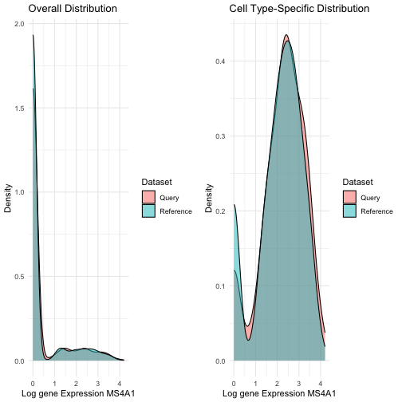

In the provided example, we examined the distribution of expression values for the gene MS4A1, a marker for naive B cells, in both the query and reference datasets. Additionally, we also looked at the distribution of MS4A1 expression in the B_and_plasma cell type. We observed overlapping distributions in both cases, suggesting alignment between the reference and query datasets.

## Evaluating Alignment Between Reference and Query Datasets in Terms of Highly Variable Genes

We are assessing the similarity or alignment between two datasets, the reference dataset, and the query dataset, in terms of highly variable genes (HVGs). We calculate the overlap coefficient between the sets of highly variable genes in the reference and query datasets. The overlap coefficient quantifies the degree of overlap or similarity between these two sets of genes. A value closer to 1 indicates a higher degree of overlap, while a value closer to 0 suggests less overlap. The computed overlap coefficient is printed, providing a numerical measure of how well the highly variable genes in the reference and query datasets align. In this case, the overlap coefficient is 0.62, indicating a moderate level of overlap.


```r

# Selecting highly variable genes
ref_var <- getTopHVGs(ref_data, n=2000)
query_var <- getTopHVGs(query_data, n=2000)

# Compute the overlap coefficient
overlap_coefficient <- calculateHVGOverlap(reference_genes = ref_var, 
                                           query_genes = query_var)
print(overlap_coefficient)
#> [1] 0.63
```

In the provided example, we examined the distribution of expression values for the gene MS4A1, a marker for naive B cells, in both the query and reference datasets. Additionally, we also looked at the distribution of MS4A1 expression in the B_and_plasma cell type. We observed overlapping distributions in both cases, suggesting alignment between the reference and query datasets.

## Visualize Gene Expression on Dimensional Reduction Plot

To gain insights into the gene expression patterns and their representation in a dimensional reduction space, we can utilize the plotGeneExpressionDimred function. This function allows us to plot the gene expression values of a specific gene on a dimensional reduction plot generated using methods like t-SNE, UMAP, or PCA. Each single cell is color-coded based on its expression level of the gene of interest.

In the provided example, we are visualizing the gene expression values of the gene "VPREB3" on a PCA plot. The PCA plot represents the cells in a lower-dimensional space, where the x-axis corresponds to the first principal component (Dimension 1) and the y-axis corresponds to the second principal component (Dimension 2). Each cell is represented as a point on the plot, and its color reflects the expression level of the gene "VPREB3," ranging from low (lighter color) to high (darker color).


```r
# Generate dimension reduction plot color code by gene expression
plotGeneExpressionDimred(se_object = query_data, 
                         method = "PCA", 
                         n_components = c(1, 2), 
                         feature = "VPREB3")
```

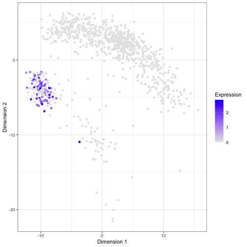

The dimensional reduction plot allows us to observe how the gene expression of VPREB3 is distributed across the cells and whether any clusters or patterns emerge in the data.

## Visualize Gene Sets or Pathway Scores on Dimensional Reduction Plot

In addition to examining individual gene expression patterns, it is often useful to assess the collective activity of gene sets or pathways within single cells. This can provide insights into the functional states or biological processes associated with specific cell types or conditions. To facilitate this analysis, the scDiagnostics package includes a function called plotGeneSetScores that enables the visualization of gene set or pathway scores on a dimensional reduction plot.

The plotGeneSetScores function allows you to plot gene set or pathway scores on a dimensional reduction plot generated using methods such as PCA, t-SNE, or UMAP. Each single cell is color-coded based on its scores for specific gene sets or pathways. This visualization helps identify the heterogeneity and patterns of gene set or pathway activity within the dataset, potentially revealing subpopulations with distinct functional characteristics.


```r

# Compute scores using AUCell
expression_matrix <- assay(query_data, "logcounts")
cells_rankings <- AUCell_buildRankings(expression_matrix, plotStats = F)
#> Error in AUCell_buildRankings(expression_matrix, plotStats = F): could not find function "AUCell_buildRankings"

# Generate gene sets
gene_set1 <- sample(rownames(expression_matrix), 10)
gene_set2 <- sample(rownames(expression_matrix), 20)

gene_sets <- list(geneSet1 = gene_set1,
                  geneSet2 = gene_set2)

# Calculate AUC scores for gene sets
cells_AUC <- AUCell_calcAUC(gene_sets, cells_rankings)
#> Error in AUCell_calcAUC(gene_sets, cells_rankings): could not find function "AUCell_calcAUC"

# Assign scores to colData
colData(query_data)$geneSetScores <- assay(cells_AUC)["geneSet1", ]
#> Error in h(simpleError(msg, call)): error in evaluating the argument 'x' in selecting a method for function 'assay': object 'cells_AUC' not found

# Plot gene set scores on PCA
plotGeneSetScores(se_object = query_data, 
                  method = "PCA", 
                  feature = "geneSetScores")
#> Error in retrieveCellInfo(se, colour_by, assay.type = by.assay.type, swap_rownames = swap_rownames): cannot find 'geneSetScores'
```

In the provided example, we demonstrate the usage of the plotGeneSetScores function using the AUCell package to compute gene set or pathway scores. Custom gene sets are generated for demonstration purposes, but users can provide their own gene set scores using any method of their choice. It is important to ensure that the scores are assigned to the colData of the reference or query object and specify the correct feature name for visualization.

By visualizing gene set or pathway scores on a dimensional reduction plot, you can gain a comprehensive understanding of the functional landscape within your single-cell gene expression dataset and explore the relationships between gene set activities and cellular phenotypes.

## Visualizing Reference and Query Cell Types using Multidimensional Scaling (MDS)

This function performs Multidimensional Scaling (MDS) analysis on the query and reference datasets to examine their similarity. The dissimilarity matrix is calculated based on the correlation between the datasets, representing the distances between cells in terms of gene expression patterns. MDS is then applied to derive low-dimensional coordinates for each cell. Subsequently, a scatter plot is generated, where each data point represents a cell, and cell types are color-coded using custom colors provided by the user. This visualization enables the comparison of cell type distributions between the query and reference datasets in a reduced-dimensional space.

The rationale behind this function is to visually assess the alignment and relationships between cell types in the query and reference datasets.


```r

# Intersect the gene symbols to obtain common genes
common_genes <- intersect(ref_var, query_var)

# Select desired cell types
selected_cell_types <- c("CD4", "CD8", "B_and_plasma")
ref_data_subset <- ref_data[common_genes, ref_data$reclustered.broad %in% selected_cell_types]
query_data_subset <- query_data[common_genes, query_data$labels %in% selected_cell_types]

# Extract cell types for visualization
ref_labels <- ref_data_subset$reclustered.broad
query_labels <- query_data_subset$labels

# Combine the cell type labels from both datasets
mdata <- c(paste("Query", query_labels), paste("Reference", ref_labels))

## Define the cell types and legend order
cell_types <- c("Query CD8", "Reference CD8", "Query CD4", "Reference CD4", "Query B_and_plasma", "Reference B_and_plasma")
legend_order <- cell_types

## Define the colors for cell types
color_palette <- brewer.pal(length(cell_types), "Paired")
color_mapping <- setNames(color_palette, cell_types)
cell_type_colors <- color_mapping[cell_types]

## Generate the MDS scatter plot with cell type coloring
visualizeCellTypeMDS(query_data = query_data_subset, 
                     reference_data = ref_data_subset, 
                     mdata = mdata, 
                     cell_type_colors = cell_type_colors, 
                     legend_order = legend_order)
```

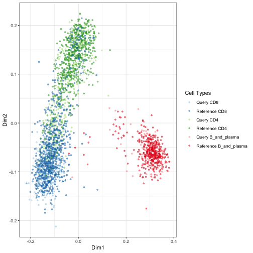

Upon examining the MDS scatter plot, we observe that the CD4 and CD8 cell types overlap to some extent.By observing the proximity or overlap of different cell types, one can gain insights into their potential relationships or shared characteristics.

The selection of custom genes and desired cell types depends on the user's research interests and goals. It allows for flexibility in focusing on specific genes and examining particular cell types of interest in the visualization.

## Cell Type-specific Pairwise Correlation Analysis and Visualization

This analysis aims to explore the correlation patterns between different cell types in a single-cell gene expression dataset. The goal is to compare the gene expression profiles of cells from a reference dataset and a query dataset to understand the relationships and similarities between various cell types. 

To perform the analysis, we start by computing the pairwise correlations between the query and reference cells for selected cell types ("CD4", "CD8", "B_and_plasma"). The Spearman correlation method is used, user can also use Pearsons correlation coeefficient.

This will return average correlation matrix which can be visulaized by user's method of choice. Here, 
the results are visualized as a correlation plot using the corrplot package.


```r
selected_cell_types <- c("CD4", "CD8", "B_and_plasma")
cor_matrix_avg <- computeAveragePairwiseCorrelation(query_data = query_data_subset, 
                                                    reference_data = ref_data_subset, 
                                                    query_cell_type_col = "labels", 
                                                    ref_cell_type_col = "reclustered.broad", 
                                                    cell_types = selected_cell_types, 
                                                    correlation_method = "spearman")

# Plot the pairwise average correlations using corrplot
corrplot(cor_matrix_avg, method = "number", tl.col = "black")
#> Error in corrplot(cor_matrix_avg, method = "number", tl.col = "black"): could not find function "corrplot"
```

In this case, users have the flexibility to extract the gene expression profiles of specific cell types from the reference and query datasets and provide these profiles as input to the function. Additionally, they can select their own set of genes that they consider relevant for computing the pairwise correlations. For demonstartion we have used common highly variable genes from reference and query dataset.

By providing their own gene expression profiles and choosing specific genes, users can focus the analysis on the cell types and genes of interest to their research question. 

## Pairwise Distance Analysis and Density Visualization

This function serves to conduct a analysis of pairwise distances or correlations between cells of specific cell types within a single-cell gene expression dataset. By calculating these distances or correlations, users can gain insights into the relationships and differences in gene expression profiles between different cell types. The function facilitates this analysis by generating density plots, allowing users to visualize the distribution of distances or correlations for various pairwise comparisons.

The analysis offers the flexibility to select a particular cell type for examination, and users can choose between different distance metrics, such as "euclidean" or "manhattan," to calculate pairwise distances.

To illustrate, the function is applied to the cell type CD8 using the euclidean distance metric in the example below.


```r
calculatePairwiseDistancesAndPlotDensity(query_data = query_data_subset, 
                                         reference_data = ref_data_subset, 
                                         query_cell_type_col = "labels", 
                                         ref_cell_type_col = "reclustered.broad", 
                                         cell_type_query = "CD8", 
                                         cell_type_reference = "CD8", 
                                         distance_metric = "euclidean")
```

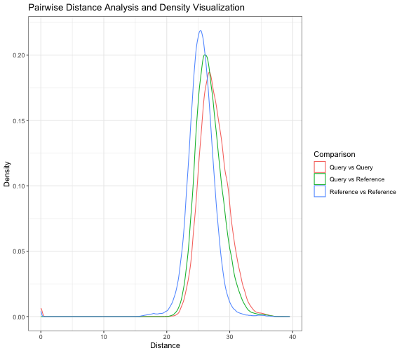

Alternatively, users can opt for the "correlation" distance metric, which measures the similarity in gene expression profiles between cells. 

To illustrate, the function is applied to the cell type CD8 using the correlation distance metric in the example below. By selecting either the "pearson" or "spearman" correlation method, users can emphasize either linear or rank-based associations, respectively.


```r
calculatePairwiseDistancesAndPlotDensity(query_data = query_data_subset, 
                                         reference_data = ref_data_subset, 
                                         query_cell_type_col = "labels", 
                                         ref_cell_type_col = "reclustered.broad", 
                                         cell_type_query = "CD8", 
                                         cell_type_reference = "CD8", 
                                         distance_metric = "correlation",
                                         correlation_method = "spearman")
```

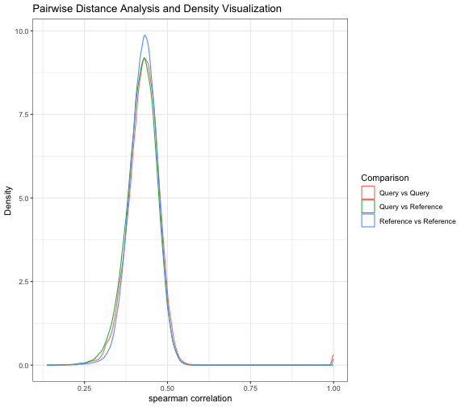

By utilizing this function, users can explore the pairwise distances between query and reference cells of a specific cell type and gain insights into the distribution of distances through density plots. This analysis aids in understanding the similarities and differences in gene expression profiles for the selected cell type within the query and reference datasets.

## PC regression analysis

Performing PC regression analysis on a SingleCellExperiment object enables users to examine the relationship between a principal component (PC) from the dimension reduction slot and an independent variable of interest. By specifying the desired dependent variable as one of the principal components (e.g., "PC1", "PC2", etc.) and providing the corresponding independent variable from the colData slot (e.g. "cell_type"), users can explore the associations between linear structure in the single-cell gene expression dataset (reference and query) and an independent variable of interest (e.g. cell type or batch).

The function prints two diagnostic plots by default:

* a plot of the two PCs with the highest R^2^ with the specified independent variable
* a dot plot showing the R^2^ of each consecutive PC ~ indep.var regression
  * Generally you should expect this plot to die off to near 0 before ~PC10
  * Interpretation example: If the R^2^ values are high (>=50%) anywhere in PCs 1-5 and your independent variable is "batch", you have batch effects!


```r
 # Specify the dependent variables (principal components) and independent variable (e.g., "labels")
dep.vars <- paste0("PC", 1:12)
indep.var <- "labels"

# Perform linear regression on multiple principal components
result <- regressPC(sce = query_data,
                    dep.vars = dep.vars, 
                    indep.var = indep.var)
```

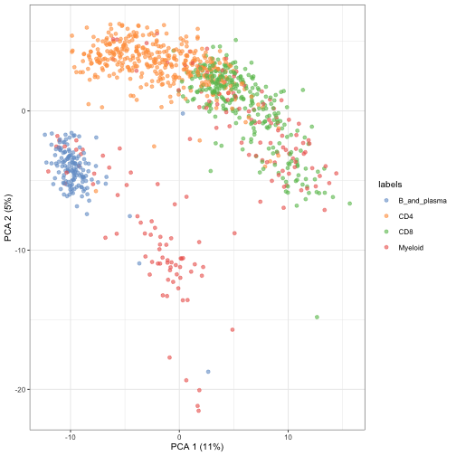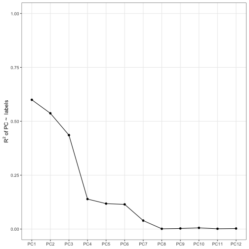

```r

# Print the summaries of the linear regression models and R-squared values

# Summaries of the linear regression models
result$regression.summaries[[1]]
#> 
#> Call:
#> lm(formula = f, data = df)
#> 
#> Residuals:
#>      Min       1Q   Median       3Q      Max 
#> -14.4118  -2.5919  -0.3286   2.5929  12.2589 
#> 
#> Coefficients:
#>                    Estimate Std. Error t value Pr(>|t|)    
#> (Intercept)         -9.6062     0.3500  -27.45   <2e-16 ***
#> IndependentCD4       7.7054     0.4108   18.76   <2e-16 ***
#> IndependentCD8      15.3986     0.4271   36.05   <2e-16 ***
#> IndependentMyeloid  11.9732     0.4753   25.19   <2e-16 ***
#> ---
#> Signif. codes:  0 '***' 0.001 '**' 0.01 '*' 0.05 '.' 0.1 ' ' 1
#> 
#> Residual standard error: 4.156 on 965 degrees of freedom
#> Multiple R-squared:  0.5996,	Adjusted R-squared:  0.5984 
#> F-statistic: 481.7 on 3 and 965 DF,  p-value: < 2.2e-16

# R-squared values
result$rsquared
#>         PC1         PC2         PC3         PC4         PC5         PC6 
#> 0.599614123 0.537021405 0.435744738 0.139056106 0.117961322 0.114439358 
#>         PC7         PC8         PC9        PC10        PC11        PC12 
#> 0.039179544 0.001160446 0.002783929 0.005571931 0.001378947 0.002534793

# Variance contributions for each principal component
result$var.contributions
#>          PC1          PC2          PC3          PC4          PC5          PC6 
#> 6.7286315831 2.7629320174 1.2945575966 0.3166828703 0.2377093993 0.1592056363 
#>          PC7          PC8          PC9         PC10         PC11         PC12 
#> 0.0426559772 0.0008730584 0.0020421974 0.0038728627 0.0008466853 0.0014487730

# Total variance explained
result$total.variance.explained
#> [1] 11.55146
```

This analysis helps uncover whether there is a systematic variation in PC values across different cell types. In the example above, we can see that the four cell types are spread out across both PC1 and PC2. Digging into the genes with high loadins on these PCs can help explain the biological or technical factors driving cellular heterogeneity. It can help identify PC dimensions that capture variation specific to certain cell types or distinguish different cellular states. 

Let's look at the genes driving PC1 by ordering the rotation matrix by the absolute gene loadings for PC1:


```r
pc_df <-  attr(reducedDims(query_data)$PCA, "rotation")[,1:5] |> 
  as.data.frame()

pc_df[order(abs(pc_df$PC1)),] |> 
  tail()
#>            PC1         PC2         PC3          PC4         PC5
#> GZMA 0.1517186  0.04586987 -0.08107421 -0.026938885 -0.02137103
#> GNLY 0.1552411 -0.08726472  0.12820759 -0.101178473 -0.31953772
#> CST7 0.1665665  0.02884329 -0.08880178 -0.034188322 -0.06706179
#> CCL4 0.1686632  0.03547543 -0.17317610 -0.009090169  0.01089660
#> CCL5 0.1815465  0.12081019 -0.19633461  0.008349436  0.06547467
#> NKG7 0.2286197  0.01800213 -0.04694001 -0.090383938 -0.13464307
```

PC1 is mostly driven by NKG7 - Natural Killer Cell Granule Protein 7. This gene is important in CD8+ T cells, so that makes sense that it's distinguishing the cell types shown.

> Exercise: What genes are driving PC2? Do they make sense?


> Exercise: Try to use the command below to examine the spike on PC5. What's going on there?

`plotPCA(query_data, ncomponents = c(1,5), color_by = "labels")`


## Outlier detection

Isolation forests are a fast and effective method for detecting outliers in high-dimensional data without relying on density estimation. `calculateOutlierScore()` is a wrapper around the main function of the [isotree package](https://cran.r-project.org/web/packages/isotree/index.html). Here we run it on the PC embeddings but, it can also be informative to run it on the raw counts. Here we can see some outliers in PC1/2 space flagged by the default `score > 0.5` threshold due to their clear isolation (as well as a few that are isolated on the non-visualized PCs).


```r
query_data <- calculateOutlierScore(query_data, 
                                    use_pcs = TRUE, 
                                    plot = TRUE,
                                    dimred = "PCA")
#> Warning in isotree::isolation.forest(X, output_score = TRUE, ...): Attempting
#> to use more than 1 thread, but package was compiled without OpenMP support. See
#> https://github.com/david-cortes/installing-optimized-libraries#4-macos-install-and-enable-openmp
```

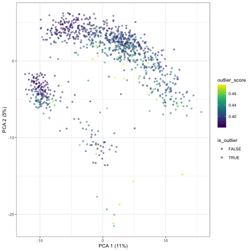

Columns `outlier_score` and `is_outlier` are added to the colData of the output. The isotree model object itself is added to the metadata.

One can pass different `dimred` names to change the plot, but running an isolation in forest in e.g. tSNE or UMAP space does not make sense due to the non-linearity of these approaches. Hence this is not allowed - when `use_pcs = FALSE`, the logcounts are used instead.

## Annotation entropy

In order to assess the confidence of cell type predictions, we can use the function `calculateCategorizationEntropy()`. This function calculates the information entropy of assignment probabilities across a set of cell types for each cell. If a set of class probabilities are confident, the entropies will be low. 

This can be used to compare two sets of cell type assignments (e.g. from different type assignment methods) to compare their relative confidence. **Please note that this has nothing to do with their accuracy!** Computational methods can sometimes be confidently incorrect.

The cell type probabilities should be passed as a matrix with cell types as rows and cells as columns. If the columns of the matrix are not valid probability distributions (i.e. don't sum to 1 as in the below example), the function will perform a column-wise softmax to convert them to a probability scale. This may or may not work well depending on the distribution of the inputs, so if at all possible try to pass probabilities instead of arbitrary scores.

In this example, we create 500 random cells with random normal cell type "scores" across 4 cell types. For demonstration we make the score of the first class much higher in the first 250 cells. After the softmax, this will equate to a very high probability of cell type 1. The remaining 250 will have assignments that are roughly even across the four cell types (i.e. high entropy).


```r
X <- rnorm(500 * 4) |> matrix(nrow = 4)
X[1, 1:250] <- X[1, 1:250] + 5 

entropy_scores <- calculateCategorizationEntropy(X)
#> X doesn't seem to be on the probability scale, applying column-wise softmax.
#> Max possible entropy given 4 categories: 1.39
```

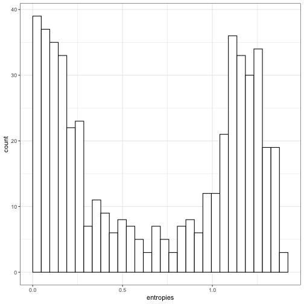

From the plot we can see that half of the cells (the first half we shifted to class 1) have low entropy, and half have high entropy.

# Conclusion

In this analysis, we have demonstrated the capabilities of the scDiagnostics package for assessing the appropriateness of cell assignments in single-cell gene expression profiles. By utilizing various diagnostic functions and visualization techniques, we have explored different aspects of the data, including total UMI counts, annotation scores, gene expression distributions, dimensional reduction plots, gene set scores, pairwise correlations, pairwise distances, and linear regression analysis.

Through the scatter plots, histograms, and dimensional reduction plots, we were able to gain insights into the relationships between gene expression patterns, cell types, and the distribution of cells in a reduced-dimensional space. The examination of gene expression distributions, gene sets, and pathways allowed us to explore the functional landscape and identify subpopulations with distinct characteristics within the dataset. Additionally, the pairwise correlation and distance analyses provided a deeper understanding of the similarities and differences between cell types, highlighting potential relationships and patterns.


***

## R.session Info


```
R version 4.3.2 (2023-10-31)
Platform: aarch64-apple-darwin20 (64-bit)
Running under: macOS Sonoma 14.4

Matrix products: default
BLAS:   /Library/Frameworks/R.framework/Versions/4.3-arm64/Resources/lib/libRblas.0.dylib 
LAPACK: /Library/Frameworks/R.framework/Versions/4.3-arm64/Resources/lib/libRlapack.dylib;  LAPACK version 3.11.0

locale:
[1] en_US.UTF-8/en_US.UTF-8/en_US.UTF-8/C/en_US.UTF-8/en_US.UTF-8

time zone: Pacific/Honolulu
tzcode source: internal

attached base packages:
[1] stats4    stats     graphics  grDevices utils     datasets  methods  
[8] base     

other attached packages:
 [1] celldex_1.12.0              SingleR_2.4.1              
 [3] RColorBrewer_1.1-3          scRNAseq_2.16.0            
 [5] scran_1.30.2                scater_1.30.1              
 [7] ggplot2_3.5.0               scuttle_1.12.0             
 [9] scDiagnostics_0.99.0        SingleCellExperiment_1.24.0
[11] SummarizedExperiment_1.32.0 Biobase_2.62.0             
[13] GenomicRanges_1.54.1        GenomeInfoDb_1.38.8        
[15] IRanges_2.36.0              S4Vectors_0.40.2           
[17] BiocGenerics_0.48.1         MatrixGenerics_1.14.0      
[19] matrixStats_1.3.0           knitr_1.45                 

loaded via a namespace (and not attached):
  [1] later_1.3.2                   BiocIO_1.12.0                
  [3] bitops_1.0-7                  filelock_1.0.3               
  [5] tibble_3.2.1                  XML_3.99-0.16.1              
  [7] lifecycle_1.0.4               edgeR_4.0.16                 
  [9] isotree_0.6.1-1               processx_3.8.4               
 [11] lattice_0.22-6                ensembldb_2.26.0             
 [13] magrittr_2.0.3                limma_3.58.1                 
 [15] yaml_2.3.8                    remotes_2.5.0                
 [17] metapod_1.10.1                httpuv_1.6.15                
 [19] sessioninfo_1.2.2             pkgbuild_1.4.4               
 [21] DBI_1.2.2                     abind_1.4-5                  
 [23] pkgload_1.3.4                 zlibbioc_1.48.2              
 [25] purrr_1.0.2                   AnnotationFilter_1.26.0      
 [27] RCurl_1.98-1.14               rappdirs_0.3.3               
 [29] GenomeInfoDbData_1.2.11       ggrepel_0.9.5                
 [31] irlba_2.3.5.1                 dqrng_0.3.2                  
 [33] DelayedMatrixStats_1.24.0     codetools_0.2-20             
 [35] DelayedArray_0.28.0           xml2_1.3.6                   
 [37] tidyselect_1.2.1              farver_2.1.1                 
 [39] ScaledMatrix_1.10.0           viridis_0.6.5                
 [41] BiocFileCache_2.10.2          jsonlite_1.8.8               
 [43] GenomicAlignments_1.38.2      BiocNeighbors_1.20.2         
 [45] ellipsis_0.3.2                tools_4.3.2                  
 [47] progress_1.2.3                Rcpp_1.0.12                  
 [49] glue_1.7.0                    gridExtra_2.3                
 [51] SparseArray_1.2.4             xfun_0.43                    
 [53] usethis_2.2.3                 dplyr_1.1.4                  
 [55] withr_3.0.0                   BiocManager_1.30.22          
 [57] fastmap_1.1.1                 bluster_1.12.0               
 [59] fansi_1.0.6                   callr_3.7.6                  
 [61] digest_0.6.35                 rsvd_1.0.5                   
 [63] R6_2.5.1                      mime_0.12                    
 [65] colorspace_2.1-0              biomaRt_2.58.2               
 [67] RSQLite_2.3.6                 utf8_1.2.4                   
 [69] generics_0.1.3                rtracklayer_1.62.0           
 [71] prettyunits_1.2.0             httr_1.4.7                   
 [73] htmlwidgets_1.6.4             S4Arrays_1.2.1               
 [75] pkgconfig_2.0.3               gtable_0.3.4                 
 [77] blob_1.2.4                    XVector_0.42.0               
 [79] htmltools_0.5.8.1             profvis_0.3.8                
 [81] ProtGenerics_1.34.0           scales_1.3.0                 
 [83] png_0.1-8                     rjson_0.2.21                 
 [85] curl_5.2.1                    cachem_1.0.8                 
 [87] stringr_1.5.1                 BiocVersion_3.18.1           
 [89] parallel_4.3.2                miniUI_0.1.1.1               
 [91] vipor_0.4.7                   AnnotationDbi_1.64.1         
 [93] restfulr_0.0.15               desc_1.4.3                   
 [95] pillar_1.9.0                  grid_4.3.2                   
 [97] vctrs_0.6.5                   urlchecker_1.0.1             
 [99] promises_1.3.0                BiocSingular_1.18.0          
[101] dbplyr_2.5.0                  beachmat_2.18.1              
[103] xtable_1.8-4                  cluster_2.1.6                
[105] beeswarm_0.4.0                evaluate_0.23                
[107] GenomicFeatures_1.54.4        cli_3.6.2                    
[109] locfit_1.5-9.9                compiler_4.3.2               
[111] Rsamtools_2.18.0              rlang_1.1.3                  
[113] crayon_1.5.2                  labeling_0.4.3               
[115] ps_1.7.6                      fs_1.6.3                     
[117] ggbeeswarm_0.7.2              stringi_1.8.3                
[119] viridisLite_0.4.2             BiocParallel_1.36.0          
[121] munsell_0.5.1                 Biostrings_2.70.3            
[123] lazyeval_0.2.2                devtools_2.4.5               
[125] Matrix_1.6-5                  ExperimentHub_2.10.0         
[127] hms_1.1.3                     sparseMatrixStats_1.14.0     
[129] bit64_4.0.5                   KEGGREST_1.42.0              
[131] statmod_1.5.0                 shiny_1.8.1.1                
[133] highr_0.10                    interactiveDisplayBase_1.40.0
[135] AnnotationHub_3.10.1          igraph_2.0.3                 
[137] memoise_2.0.1                 bit_4.0.5                    
```

